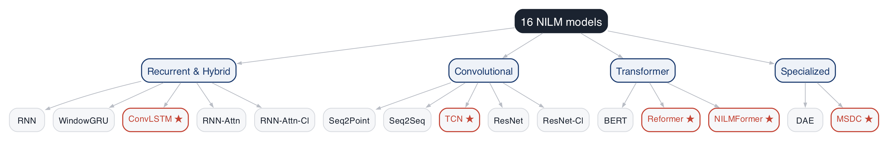
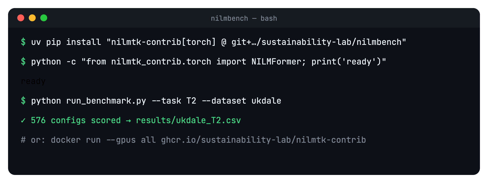

<style>
@import url('https://fonts.googleapis.com/css2?family=Playfair+Display:wght@600;700;800&family=Work+Sans:wght@300;400;500;600;700&family=JetBrains+Mono:wght@400;500&display=swap');

:root{
  --ink:#1b2330; --ink2:#48515e; --mut:#8b929c;
  --acc:#c44536; --navy:#1b3b6f;
  --line:#e6e8ec; --paper:#ffffff; --paper2:#f7f7f5;
}
section{
  background:var(--paper); color:var(--ink);
  font-family:'Work Sans',sans-serif; font-size:23px; line-height:1.5;
  padding:54px 78px 64px;
  display:flex; flex-direction:column; justify-content:flex-start;
}
/* pinned header: kicker + title sit at the same spot on every content slide */
section > .kick:first-child, section > h2:first-child{ margin-top:0; }
.kick{ font-family:'Work Sans',sans-serif; font-weight:600; font-size:13px; letter-spacing:0.18em; text-transform:uppercase; color:var(--acc); margin:0 0 6px; }
/* body after the title fills and centres in the remaining space */
.vc{ margin:auto 0; }
.fill{ margin:auto 0; width:100%; }
section::after{ color:var(--mut); font-family:'Work Sans',sans-serif; font-size:13px; right:34px; }
footer{ color:var(--mut); font-family:'Work Sans',sans-serif; font-size:13px; }

h1{ font-family:'Playfair Display',serif; font-weight:800; font-size:46px; color:var(--ink); margin:0 0 16px; letter-spacing:-0.01em; line-height:1.08; }
h2{ font-family:'Playfair Display',serif; font-weight:700; font-size:37px; color:var(--ink); margin:0 0 24px; letter-spacing:-0.01em;
    padding-bottom:14px; border-bottom:1px solid var(--line); position:relative; }
h2::after{ content:''; position:absolute; left:0; bottom:-1px; width:62px; height:3px; background:var(--acc); }
h3{ font-family:'Work Sans',sans-serif; font-weight:700; font-size:21px; margin:0 0 5px; color:var(--ink); }
h4{ font-family:'Work Sans',sans-serif; font-weight:600; font-size:13px; letter-spacing:0.16em; text-transform:uppercase; color:var(--acc); margin:0 0 14px; }
strong{ color:var(--ink); font-weight:700; }
em{ color:var(--acc); font-style:normal; font-weight:600; }
a{ color:var(--acc); text-decoration:none; }
p{ margin:0 0 14px; }

ul{ margin:6px 0; padding-left:0; list-style:none; }
li{ margin:13px 0; padding-left:26px; position:relative; color:var(--ink2); }
li strong{ color:var(--ink); }
li::before{ content:''; position:absolute; left:2px; top:11px; width:7px; height:7px; border-radius:50%; border:2px solid var(--acc); }

code{ font-family:'JetBrains Mono',monospace; font-size:.82em; color:var(--navy); background:#eef1f5; padding:2px 6px; border-radius:4px; }
pre{ background:#f6f7f9; border:1px solid var(--line); border-radius:10px; padding:18px 22px; font-size:17px; line-height:1.65; }
pre code{ background:none; color:var(--ink); padding:0; font-size:1em; }
.hljs-keyword,.hljs-built_in,.hljs-meta{ color:var(--acc); }
.hljs-string{ color:#1f7a4d; }
.hljs-comment{ color:#9aa1ac; font-style:italic; }
.hljs-number,.hljs-literal{ color:var(--navy); }
.hljs-title,.hljs-class .hljs-title,.hljs-title.class_,.hljs-title.function_{ color:#9a5b00; }

table{ border-collapse:collapse; font-size:19px; width:100%; }
th{ font-family:'Work Sans',sans-serif; font-weight:600; color:var(--ink); padding:10px 14px; text-align:left;
    border-bottom:2px solid var(--ink); font-size:13.5px; text-transform:uppercase; letter-spacing:0.05em; }
td{ padding:9px 14px; border-bottom:1px solid var(--line); color:var(--ink2); }
tr:last-child td{ border-bottom:none; }
td strong{ color:var(--acc); }

img{ display:block; margin:0 auto; }

.cols{ display:flex; gap:30px; align-items:flex-start; }
.col{ flex:1; }
.vc{ display:flex; align-items:center; gap:34px; }
.note{ color:var(--mut); font-size:17px; }
.kpis{ display:flex; gap:0; margin:10px 0 22px; }
.kpi{ flex:1; padding:0 18px; border-left:1px solid var(--line); }
.kpi:first-child{ border-left:none; padding-left:0; }
.kpi .n{ font-family:'Playfair Display',serif; font-weight:800; font-size:52px; color:var(--ink); line-height:1; }
.kpi .n em{ color:var(--acc); }
.kpi .l{ color:var(--ink2); font-size:16px; margin-top:8px; }
.lead{ font-size:25px; color:var(--ink2); max-width:90%; }
.lead strong{ color:var(--ink); }

.stage{ display:flex; align-items:stretch; gap:0; margin-top:18px; }
.stage .s{ flex:1; padding:16px 14px; border-top:3px solid var(--line); }
.stage .s.on{ border-top-color:var(--acc); }
.stage .s .y{ font-family:'JetBrains Mono',monospace; font-size:14px; color:var(--mut); }
.stage .s .t{ font-weight:600; font-size:18px; color:var(--ink); margin-top:3px; }
.stage .s .d{ font-size:14.5px; color:var(--ink2); margin-top:3px; }

.callout{ background:var(--paper2); border:1px solid var(--line); border-left:3px solid var(--acc); border-radius:8px; padding:16px 20px; font-size:20px; color:var(--ink2); }
.callout strong{ color:var(--ink); }

section.title{ justify-content:center; text-align:left; padding:44px 70px; }
section.title .t-top{ display:flex; align-items:center; justify-content:space-between; margin-bottom:10px; }
section.title .t-qr{ display:flex; flex-direction:column; align-items:center; width:120px; }
section.title .t-qr img{ width:82px; height:82px; }
section.title .t-qr span{ font-family:'JetBrains Mono',monospace; font-size:11px; color:var(--mut); margin-top:4px; letter-spacing:0.03em; }
section.title .t-lab{ height:34px; }
section.title .t-iit{ height:76px; }
section.title h1{ font-size:72px; margin:2px 0 6px; text-align:left; }
section.title .t-sub{ font-family:'Playfair Display',serif; font-style:italic; font-size:25px; color:var(--ink2); margin:0 0 14px; }
section.title .t-hr{ height:2px; background:var(--line); margin:0 0 26px; position:relative; }
section.title .t-hr::after{ content:''; position:absolute; left:0; top:0; width:80px; height:2px; background:var(--acc); }
section.title .authors{ display:flex; gap:24px; justify-content:center; margin-bottom:20px; }
section.title .authors .a{ display:flex; flex-direction:column; align-items:center; width:210px; }
section.title .authors .a img{ width:118px; height:118px; border-radius:10px; object-fit:cover; border:1px solid var(--line); }
section.title .authors .a .n{ font-weight:700; font-size:19px; color:var(--ink); margin-top:12px; }
section.title .authors .a .e{ font-family:'JetBrains Mono',monospace; font-size:12px; color:var(--acc); margin-top:3px; }
section.title .t-aff{ text-align:center; font-size:19px; color:var(--ink2); font-weight:500; margin-bottom:16px; }
section.title .t-foot{ display:flex; justify-content:space-between; font-size:14.5px; color:var(--mut); }
section.title .t-foot b{ color:var(--acc); font-weight:600; }

section.sec{ display:flex; flex-direction:column; justify-content:center; }
section.sec h1{ font-size:60px; max-width:88%; }
section.sec .k{ font-size:24px; color:var(--ink2); max-width:78%; margin-top:6px; }

.cap{ font-size:16px; color:var(--mut); text-align:center; margin-top:10px; }
</style>

<!-- _class: title -->
<!-- _paginate: false -->
<!-- _footer: '' -->

<div class="t-top">
  <div class="t-qr"><span>Project Page</span></div>
  
  
</div>

# NILMBench2026

<div class="t-sub">A deployment-aware benchmark for energy disaggregation</div>
<div class="t-hr"></div>

<div class="authors">
  <div class="a"><div class="n">Aayush Kuloor*</div><div class="e">aayush.kuloor@iitgn.ac.in</div></div>
  <div class="a"><div class="n">Anurag Singh*</div><div class="e">anurag.s@iitgn.ac.in</div></div>
  <div class="a"><div class="n">Harsh Dhru*</div><div class="e">harsh.dhru@iitgn.ac.in</div></div>
  <div class="a"><div class="n">Nipun Batra</div><div class="e">nipun.batra@iitgn.ac.in</div></div>
</div>

<div class="t-aff">Indian Institute of Technology Gandhinagar</div>
<div class="t-foot"><span>ACM BuildSys 2026 · Banff, Canada &nbsp;|&nbsp; <b>Best Paper Candidate</b></span><span>* These authors contributed equally to this work.</span></div>

---

<div class="kick">Motivation</div>

## What is NILM?

**Single smart-meter signal → appliance-level estimates**


<div class="cols" style="font-size:18px; margin-top:2px">
<div class="col">

aggregate = Σ appliance powers + noise

</div>
<div class="col">

up to **15 %** savings · no per-appliance sensors

</div>
<div class="col">

inverse problem · signatures vary by home

</div>
</div>

<div class="cap" style="text-align:left; margin-top:0">Real data: AMPds2 (public dataset)</div>

---

<div class="kick">Motivation · appliance signatures</div>

## Fridge — periodic

<div class="vc">
<div style="flex:1.35"></div>
<div style="flex:.65">

- Always-on, **periodic**
- ~100–150 W compressor cycles
- Fixed duty cycle
- Easy to detect

</div>
</div>

---

<div class="kick">Motivation · appliance signatures</div>

## Washing machine — multi-stage

<div class="vc">
<div style="flex:1.35"></div>
<div style="flex:.65">

- **Multi-stage** cycle
- Heat → wash → spin
- Long, variable duration
- Hard: many sub-states

</div>
</div>

---

<div class="kick">Motivation · appliance signatures</div>

## Dishwasher — sparse, high-power

<div class="vc">
<div style="flex:1.35"></div>
<div style="flex:.65">

- **Sparse** activations
- High-power heating bursts (~1–2 kW)
- Long idle gaps
- MAE-deceptive (mostly off)

</div>
</div>

---

<div class="kick">Background · evolution of NILM</div>

## 1980s–90s — Combinatorial (Hart)

<div class="vc">
<div style="flex:1.25"></div>
<div style="flex:.75">

- **Event-based**
- Detect ON/OFF edges (ΔP)
- Match power steps to appliances
- Breaks on variable / multi-state loads

</div>
</div>

---

<div class="kick">Background · evolution of NILM</div>

## 2000s — Probabilistic (FHMM)

<div class="vc">
<div style="flex:1.2"></div>
<div style="flex:.8">

- Each appliance = **hidden Markov chain**
- Aggregate = sum of emissions
- Infer hidden states (Kolter et al.)
- Scales poorly with #appliances

</div>
</div>

---

<div class="kick">Background · evolution of NILM</div>

## 2015 → Deep learning (Seq2Point)

<div class="vc">
<div style="flex:1.25"></div>
<div style="flex:.75">

- Kelly & Knottenbelt: NNs for NILM
- Sliding **window → CNN → midpoint**
- Signatures learned from data
- Strong intra-building accuracy

</div>
</div>

---

<div class="kick">Background · evolution of NILM</div>

## 2020 → Transformers

<div class="vc">
<div style="flex:1.25"></div>
<div style="flex:.75">

- **Self-attention** over long context
- Handles non-stationarity (NILMFormer)
- Robust at low resolution
- Higher compute cost

</div>
</div>

---

<div class="kick">Why a new benchmark</div>

## What previous benchmarks missed

| Capability | NILMTK '14 | Contrib '19 | NILMBench2026 |
|---|---|---|---|
| Models | 2 | 9 | **16** |
| Resolutions | variable | 1-min | **1-min & 15-min** |
| Efficiency (FLOPs / time) | — | — | **yes** |
| Cross-building | — | yes | yes |
| Cross-dataset | — | — | **yes** |
| Stack | Python 2.7 | TF 1.x | **PyTorch + Docker + uv** |

First benchmark to jointly score **efficiency**, **multi-resolution**, and **cross-domain transfer**.

---

<div class="kick">The benchmark</div>

## At a glance

<div class="cols">
<div class="col" style="flex:1.55"></div>
<div class="col" style="flex:.85">

**16 models · 4 families** &nbsp; ★ = 5 added here

**Resolution → application**
- **1-min** → real-time feedback, alerts
- **15-min** → grid / utility planning

**Scale** · 16 × 3 datasets × 2 res. × 6 appliances × 3 runs = **576** configs

</div>
</div>

---

<div class="kick">The benchmark</div>

## Reproducible stack — three commands

<div class="cols">
<div class="col" style="flex:.82">

#### Before
- Legacy TensorFlow / Keras
- Environment drift across papers
- Accuracy-only reporting

#### Now
- Standardized **PyTorch**
- **Docker + uv**, pinned
- Accuracy · events · compute

</div>
<div class="col" style="flex:1.3"></div>
</div>

---

<div class="kick">The benchmark · tasks</div>

## T1 — Same building

<div class="vc">
<div style="flex:1"></div>
<div style="flex:1">

**Setup** · disjoint time windows, one home
**Why** · best-case baseline
**Enables** · upper bound on accuracy; sanity check

</div>
</div>

---

<div class="kick">The benchmark · tasks</div>

## T2 — New building

<div class="vc">
<div style="flex:1"></div>
<div style="flex:1">

**Setup** · train homes → unseen home, same dataset
**Why** · realistic deployment in a region
**Enables** · cross-building generalization

</div>
</div>

---

<div class="kick">The benchmark · tasks</div>

## T3 — New dataset

<div class="vc">
<div style="flex:1"></div>
<div style="flex:1">

**Setup** · train one country → test another (REDD ↔ REFIT)
**Why** · zero-shot domain & grid shift (110 / 230 V)
**Enables** · true out-of-distribution transfer

</div>
</div>

---

<div class="kick">The benchmark · data</div>

## Datasets

| Dataset | Country | Buildings | Duration | Appliances |
|---|---|---|---|---|
| **REDD** | USA — 110 V | 6 | 3–19 days | 10–20 |
| **UK-DALE** | UK — 230 V | 5 | 655 days | 5–54 |
| **REFIT** | UK — 230 V | 20 | 2 years | 9–21 |

Six appliances · fridge · microwave · kettle · washing machine · dishwasher · television

<div class="cap" style="text-align:left">Excluded: single-building (AMPds, iAWE, BLUED, DRED) · pay-walled (PecanStreet)</div>

---

<div class="kick">Results</div>

## Finding 1 — Generalization is the bottleneck

<div class="vc">
<div style="flex:1.05">

- Accuracy collapses **T1 → T2 → T3**
- Home-specific signature, **not** transferable concept
- Symmetric in both transfer directions

<div class="callout" style="margin-top:14px">Right · NILMFormer tracks a trained TV (lower), <strong>fails on an unseen TV</strong> (upper).</div>

</div>
<div style="flex:.95"></div>
</div>

---

<div class="kick">Results</div>

## Finding 2 — MAE hides missed events


- Predict ≈ 0 → **low MAE**, miss every activation
- All four models miss the microwave spikes
- **Report F1** for sparse, high-power loads

---

<div class="kick">Results</div>

## Finding 3 — More compute ≠ better

<div class="vc">
<div style="flex:1.2"></div>
<div style="flex:.8">

- Trade-off is **non-monotonic**
- **TCN** (69K) ≈ heavyweights
- **NILMFormer** (383K) strongest
- **RNN Att. Cl.** (4.9M) expensive *and* worse

</div>
</div>

---

<div class="kick">The platform</div>

## Contribute a model or metric

<div class="cols">
<div class="col">

```python
from nilmtk.disaggregate import Disaggregator

class MyNILM(Disaggregator):
    def partial_fit(self, mains, apps): ...
    def disaggregate_chunk(self, mains): ...

experiment['methods']['MyNILM'] = MyNILM({})
```

```python
def sae(gt, pred):
    return abs(pred.sum()-gt.sum())/gt.sum()
experiment['test']['metrics'] += ['sae']
```

</div>
<div class="col">

- New model · **one class**
- New metric · **one function**
- Frozen splits & pre-processing
- Gains reflect **architecture**, not setup
- Directly comparable on a shared board

</div>
</div>

---

<div class="kick">Conclusion</div>

## A foundation for deployment

<div class="cols">
<div class="col">

#### Benchmark
16 models · 3 datasets · 2 resolutions · 576 configs

#### Finding
Generalization, not accuracy, is the bottleneck

</div>
<div class="col">

#### Platform
PyTorch + Docker + uv + NILMTK API

#### Next
Domain adaptation · self-supervised pre-training · edge NILM

</div>
</div>

<div class="callout">Code &amp; project page · github.com/sustainability-lab/nilmbench &nbsp;·&nbsp; sustainability-lab.github.io/nilmbench</div>

---

<!-- _class: sec -->
<!-- _paginate: false -->

# Thank you.

<div class="k">Generalization is the bottleneck for deployable NILM — NILMBench2026 is the reproducible platform to measure and close that gap.</div>

<br>

<div class="note">nipun.batra@iitgn.ac.in &nbsp;·&nbsp; Sustainability Lab, IIT Gandhinagar &nbsp;·&nbsp; sustainability-lab.github.io/nilmbench</div>
