<style>
@font-face{font-family:'Playfair Display';font-weight:700;font-style:normal;src:url('fonts/playfair-700.ttf')}
@font-face{font-family:'Playfair Display';font-weight:800;font-style:normal;src:url('fonts/playfair-800.ttf')}
@font-face{font-family:'Work Sans';font-weight:400;font-style:normal;src:url('fonts/worksans-400.ttf')}
@font-face{font-family:'Work Sans';font-weight:500;font-style:normal;src:url('fonts/worksans-500.ttf')}
@font-face{font-family:'Work Sans';font-weight:600;font-style:normal;src:url('fonts/worksans-600.ttf')}
@font-face{font-family:'Work Sans';font-weight:700;font-style:normal;src:url('fonts/worksans-700.ttf')}
@font-face{font-family:'JetBrains Mono';font-weight:400;font-style:normal;src:url('fonts/jetbrains-400.ttf')}
@font-face{font-family:'JetBrains Mono';font-weight:500;font-style:normal;src:url('fonts/jetbrains-500.ttf')}

:root{
  --ink:#1b2330; --ink2:#48515e; --mut:#8b929c;
  --acc:#c44536; --navy:#1b3b6f;
  --line:#e6e8ec; --paper:#ffffff; --paper2:#f7f7f5;
}

section{
  background:var(--paper); color:var(--ink);
  font-family:'Work Sans',sans-serif; font-size:22px; line-height:1.45;
  padding:48px 72px 56px;
  display:flex; flex-direction:column; justify-content:flex-start;
  overflow:hidden;
}

section::after{ color:var(--mut); font-family:'Work Sans',sans-serif; font-size:12px; right:32px; }
footer{ color:var(--mut); font-family:'Work Sans',sans-serif; font-size:12px; }

h1{ font-family:'Playfair Display',serif; font-weight:800; font-size:44px; color:var(--ink); margin:0 0 12px; letter-spacing:-0.01em; line-height:1.08; }
h2{ font-family:'Playfair Display',serif; font-weight:700; font-size:34px; color:var(--ink); margin:0 0 18px; letter-spacing:-0.01em;
    padding-bottom:12px; border-bottom:1px solid var(--line); position:relative; flex-shrink:0; }
h2::after{ content:''; position:absolute; left:0; bottom:-1px; width:58px; height:3px; background:var(--acc); }
h3{ font-family:'Work Sans',sans-serif; font-weight:700; font-size:20px; margin:0 0 4px; color:var(--ink); }
h4{ font-family:'Work Sans',sans-serif; font-weight:600; font-size:12px; letter-spacing:0.16em; text-transform:uppercase; color:var(--acc); margin:0 0 10px; }
strong{ color:var(--ink); font-weight:700; }
em{ color:var(--acc); font-style:normal; font-weight:600; }
a{ color:var(--acc); text-decoration:none; }
p{ margin:0 0 10px; }

.kick{ font-family:'Work Sans',sans-serif; font-weight:600; font-size:12px; letter-spacing:0.18em; text-transform:uppercase; color:var(--acc); margin:0 0 4px; flex-shrink:0; }
section > .kick:first-child, section > h2:first-child{ margin-top:0; }

.slide-body{ flex:1; display:flex; flex-direction:column; justify-content:center; min-height:0; width:100%; }
.slide-body.tight{ justify-content:flex-start; padding-top:4px; }

ul{ margin:4px 0; padding-left:0; list-style:none; }
li{ margin:10px 0; padding-left:24px; position:relative; color:var(--ink2); font-size:20px; }
li strong{ color:var(--ink); }
li::before{ content:''; position:absolute; left:2px; top:10px; width:6px; height:6px; border-radius:50%; border:2px solid var(--acc); }

code{ font-family:'JetBrains Mono',monospace; font-size:.82em; color:var(--navy); background:#eef1f5; padding:2px 6px; border-radius:4px; }
pre{ background:#f6f7f9; border:1px solid var(--line); border-radius:10px; padding:16px 20px; font-size:16px; line-height:1.6; margin:0; }
pre code{ background:none; color:var(--ink); padding:0; font-size:1em; }

table{ border-collapse:collapse; font-size:18px; width:100%; }
th{ font-family:'Work Sans',sans-serif; font-weight:600; color:var(--ink); padding:8px 12px; text-align:left;
    border-bottom:2px solid var(--ink); font-size:12.5px; text-transform:uppercase; letter-spacing:0.05em; }
td{ padding:8px 12px; border-bottom:1px solid var(--line); color:var(--ink2); }
tr:last-child td{ border-bottom:none; }
table.dataset-table tr:last-child td{ border-bottom:2px solid var(--ink); }
.dataset-wrap table tr:last-child td{ border-bottom:2px solid var(--ink); }

.callout-full{ width:100%; margin-top:16px; font-size:18px; }
td strong{ color:var(--acc); }

img{ display:block; margin:0 auto; max-width:100%; }
.fig{ width:100%; max-height:380px; object-fit:contain; object-position:center center; }
.fig-lg{ width:100%; max-height:430px; object-fit:contain; }
.fig-xl{ width:100%; max-height:480px; object-fit:contain; }

.decomp-layout{ align-items:center; gap:32px; }
.decomp-layout .fig-col{ flex:1.15; }
.decomp-layout .txt-col{ flex:0.85; display:flex; flex-direction:column; justify-content:center; gap:14px; }
.decomp-layout .txt-col li{ font-size:19px; }
.decomp-aside{ font-size:15px; color:var(--mut); line-height:1.45; padding-top:8px; border-top:1px solid var(--line); margin-top:4px; }

section.bench-slide{ padding-bottom:48px; padding-top:38px; }
section.bench-slide h2{ margin-bottom:8px; padding-bottom:8px; font-size:28px; line-height:1.15; }
section.bench-slide .kpi .n{ font-size:36px; }
section.bench-slide .kpi .l{ font-size:13px; line-height:1.3; }
section.bench-slide .kpis{ margin:0 0 14px; }
section.bench-slide li{ font-size:16px; margin:5px 0; line-height:1.3; }
section.bench-slide h4{ font-size:11px; margin-bottom:8px; letter-spacing:0.14em; }
.bench-body{ display:flex; gap:28px; flex:1; min-height:0; align-items:flex-start; width:100%; }
.bench-info{ flex:0.46; min-width:0; display:flex; flex-direction:column; gap:18px; }
.bench-block ul{ margin:0; }
.bench-shot{ flex:0.54; min-width:0; display:flex; align-items:flex-start; justify-content:center; padding-top:10px; }
.bench-shot img{ width:86%; height:auto; object-fit:contain; object-position:center top; border:1px solid var(--line); border-radius:6px; margin:0 auto; background:#1e1e1e; transform:translate(-14px, 12px); }
.bench-callout-full{ margin-top:14px; font-size:15px; padding:10px 14px; line-height:1.35; flex-shrink:0; }

.task-row .task-card .tt{ font-size:19px; }
.task-row .task-card .meta{ font-size:16.5px; gap:8px; }
.task-row .task-card .tl{ font-size:12px; }
.task-row .task-card img{ height:200px; }

.outlook-slide h2{ font-size:32px; }
.outlook-slide h4{ font-size:14px; margin-bottom:14px; }
.outlook-slide li{ font-size:22px; margin:12px 0; }
.outlook-grid{ display:grid; grid-template-columns:0.43fr 0.57fr; gap:26px; align-items:start; width:100%; flex:1; min-height:0; }
.outlook-copy{ display:grid; grid-template-columns:1fr; gap:18px; align-content:start; }
.outlook-grid h4{ font-size:13px; margin-bottom:10px; }
.outlook-grid li{ font-size:18px; margin:8px 0; line-height:1.32; }
.outlook-leaderboard{ width:100%; border:1px solid var(--line); border-radius:8px; box-shadow:0 16px 34px -26px rgba(27,35,48,.45); }
.outlook-link{ margin-top:16px; font-size:18px; color:var(--ink2); text-align:center; }
.outlook-link a{ font-weight:600; }
.outlook-qr{ text-align:center; margin-top:10px; }
.outlook-qr img{ width:96px; height:96px; margin:0 auto; display:block; }

.leader-stack{ display:flex; flex-direction:column; gap:16px; width:100%; }
.leader-stack .leader-top{ margin:0; }
.leader-top{ align-items:flex-start; align-content:start; margin-top:0; }
.leader-top pre{ font-size:15px; padding:14px 18px; }
.leader-top .copy li{ font-size:20px; }
section.platform{ padding-top:44px; }
section.platform .slide-body{ justify-content:flex-start; padding-top:8px; }

.cols{ display:flex; gap:28px; align-items:center; }
.col{ flex:1; min-width:0; }
.vc{ display:flex; align-items:center; gap:28px; width:100%; }
.vc .fig-col{ flex:1.1; min-width:0; display:flex; align-items:center; justify-content:center; }
.vc .txt-col{ flex:0.9; min-width:0; }

.callout{ background:var(--paper2); border:1px solid var(--line); border-left:3px solid var(--acc); border-radius:8px; padding:14px 18px; font-size:18px; color:var(--ink2); }
.callout strong{ color:var(--ink); }
.cap{ font-size:14px; color:var(--mut); margin-top:6px; line-height:1.35; }
.note{ color:var(--mut); font-size:16px; }

.kpis{ display:flex; gap:0; margin:8px 0 16px; }
.kpi{ flex:1; padding:0 16px; border-left:1px solid var(--line); }
.kpi:first-child{ border-left:none; padding-left:0; }
.kpi .n{ font-family:'Playfair Display',serif; font-weight:800; font-size:46px; color:var(--ink); line-height:1; }
.kpi .l{ color:var(--ink2); font-size:15px; margin-top:6px; line-height:1.35; }

/* ---- title slide ---- */
section.title{
  padding:36px 64px 40px;
  justify-content:space-between;
}
section.title h1{
  font-size:56px; margin:0 0 6px; line-height:1.05;
}
.title-bar{
  display:flex; align-items:center;
  margin-bottom:18px;
  padding-right:120px;
}
.title-left{ display:flex; align-items:center; gap:14px; flex-shrink:0; }
.title-bar img.title-lab{ height:52px; width:auto; margin:0; }
.title-bar img.title-iit{ height:64px; width:auto; margin:0; }
.title-qr{
  display:flex; flex-direction:column; align-items:center; gap:3px;
  margin-left:2px;
}
.title-qr img{ width:68px; height:68px; margin:0; }
.title-qr span{ font-family:'JetBrains Mono',monospace; font-size:10px; color:var(--mut); letter-spacing:0.04em; }
.title-sub{
  font-family:'Playfair Display',serif; font-style:italic; font-size:21px; color:var(--ink2); margin:0 0 14px;
}
.title-rule{ height:2px; background:var(--line); margin:0 0 20px; position:relative; }
.title-rule::after{ content:''; position:absolute; left:0; top:0; width:72px; height:2px; background:var(--acc); }
.author-row{
  display:flex; gap:18px; justify-content:center; flex-wrap:wrap;
  margin-bottom:14px;
}
.author-row .a{
  display:flex; flex-direction:column; align-items:center; width:210px;
}
.author-row .a img{
  width:120px; height:120px; border-radius:10px; object-fit:cover; object-position:center top; border:1px solid var(--line); margin:0; flex-shrink:0;
}
.author-row .a.advisor img{ width:120px; height:120px; margin-top:0; }
.author-row .a .n{ font-weight:700; font-size:17px; color:var(--ink); margin-top:9px; text-align:center; line-height:1.2; }
.author-row .a .role{ font-size:13px; color:var(--ink2); margin-top:3px; text-align:center; line-height:1.35; }
.author-row .a .e{ font-family:'JetBrains Mono',monospace; font-size:10px; color:var(--acc); margin-top:3px; text-align:center; word-break:break-all; }
.title-meta{
  text-align:center; font-size:13px; color:var(--ink2); line-height:1.5; margin:0;
}
.title-meta b{ color:var(--acc); font-weight:600; }
.title-badge{
  display:inline-flex; align-items:center; gap:9px; align-self:flex-start;
  background:linear-gradient(180deg, rgba(196,69,54,.12), rgba(196,69,54,.04));
  border:1.5px solid var(--acc); color:var(--acc);
  font-family:'Work Sans',sans-serif; font-weight:700; font-size:13px;
  letter-spacing:0.13em; text-transform:uppercase;
  padding:7px 15px 7px 12px; border-radius:999px; margin:0 0 16px;
  box-shadow:0 6px 18px -12px rgba(196,69,54,.6);
}
.title-badge .medal{ flex-shrink:0; display:block; width:16px; height:16px; }

/* ---- appliance signatures (one slide) ---- */
.sig-grid{ display:grid; grid-template-columns:repeat(3,1fr); gap:16px; width:100%; }
.sig-panel{ border-top:3px solid var(--line); padding-top:8px; display:flex; flex-direction:column; }
.sig-panel:nth-child(1){ border-top-color:var(--navy); }
.sig-panel:nth-child(2){ border-top-color:var(--acc); }
.sig-panel:nth-child(3){ border-top-color:#2a9d8f; }
.sig-panel img{ width:100%; height:190px; object-fit:contain; object-position:center bottom; margin:0 0 8px; }
.sig-panel .sig-label{ font-weight:700; font-size:16px; color:var(--ink); margin-bottom:4px; }
.sig-panel ul{ margin:0; }
.sig-panel li{ font-size:14.5px; margin:5px 0; padding-left:18px; line-height:1.3; }
.sig-panel li::before{ width:5px; height:5px; top:7px; border-width:1.5px; }
/* slide-3 spotlight build: dim future panels, lift the active one */
.sig-panel{ opacity:.24; filter:grayscale(.5);
  transition:opacity .35s ease, filter .35s ease, box-shadow .35s ease, transform .35s ease, border-top-width .35s ease; }
.sig-panel.seen{ opacity:1; filter:none; }
.sig-panel.on{ opacity:1; filter:none; border-top-width:4px; transform:translateY(-3px);
  box-shadow:0 12px 28px -16px rgba(27,35,48,.45);
  background:linear-gradient(180deg, rgba(27,35,48,.045), rgba(27,35,48,0) 58%); border-radius:0 0 8px 8px; }
/* generic reveal utility: not-yet-spoken content fades back */
.fade{ opacity:.16; transition:opacity .4s ease; }

/* ---- evolution timeline ---- */
section.evo-slide{ padding-bottom:48px; }
section.evo-slide h2{ margin-bottom:14px; padding-bottom:10px; font-size:32px; }
.evo-wrap{ display:flex; flex-direction:column; gap:10px; width:100%; flex:1; min-height:0; }
.evo-stage{ display:grid; grid-template-columns:repeat(2,1fr); gap:12px 18px; flex:1; min-height:0; }
.evo-step{ border-top:3px solid var(--line); padding-top:8px; display:flex; flex-direction:column; min-height:0; overflow:hidden;
  opacity:.24; filter:grayscale(.55); transition:opacity .35s ease, filter .35s ease, border-color .35s ease, box-shadow .35s ease, transform .35s ease; }
.evo-step.seen{ opacity:1; filter:none; }
.evo-step.on{ opacity:1; filter:none; border-top-color:var(--acc);
  background:linear-gradient(180deg, rgba(196,69,54,.08), rgba(196,69,54,0) 62%);
  box-shadow:0 10px 26px -16px rgba(27,35,48,.45); transform:translateY(-2px); border-radius:0 0 8px 8px; }
.evo-step.on .era{ color:var(--acc); }
.evo-step.on .name{ color:var(--acc); }
.evo-step .era{ font-family:'JetBrains Mono',monospace; font-size:11px; color:var(--mut); margin-bottom:2px; }
.evo-step .name{ font-weight:700; font-size:16px; color:var(--ink); margin-bottom:4px; line-height:1.2; }
.evo-step .fig-box{ flex:1; min-height:0; display:flex; align-items:center; justify-content:center; overflow:hidden; margin-bottom:4px; }
.evo-step .fig-box img{ width:100%; max-height:138px; height:auto; object-fit:contain; margin:0; }
.evo-step ul{ margin:0; }
.evo-step li{ font-size:13.5px; margin:3px 0; padding-left:16px; line-height:1.25; }
.evo-step li::before{ width:4px; height:4px; top:6px; }
.evo-callout{ margin-top:8px; font-size:16px; padding:12px 16px; flex-shrink:0; opacity:.22; transition:opacity .4s ease; }
.evo-callout.on{ opacity:1; }

/* ---- task cards ---- */
.task-row{ display:grid; grid-template-columns:repeat(3,1fr); gap:18px; width:100%; }
.task-card{ border-top:3px solid var(--line); padding-top:10px; display:flex; flex-direction:column; }
.task-card:nth-child(2){ border-top-color:var(--acc); }
.task-card img{ width:100%; height:178px; object-fit:contain; margin:0 0 8px; }
.task-card .tt{ font-weight:700; font-size:17px; color:var(--ink); margin-bottom:8px; }
.task-card .meta{ display:grid; gap:6px; font-size:14px; line-height:1.3; color:var(--ink2); }
.task-card .tl{ font-weight:700; font-size:11px; letter-spacing:0.08em; text-transform:uppercase; color:var(--acc); margin-right:4px; }
/* T1/T2/T3 spotlight build: dim future tasks, lift the active one */
.task-card{ opacity:.24; filter:grayscale(.5);
  transition:opacity .35s ease, filter .35s ease, box-shadow .35s ease, transform .35s ease, border-top-width .35s ease; }
.task-card.seen{ opacity:1; filter:none; }
.task-card.on{ opacity:1; filter:none; border-top-color:var(--acc); border-top-width:4px; transform:translateY(-3px);
  box-shadow:0 12px 28px -16px rgba(27,35,48,.45);
  background:linear-gradient(180deg, rgba(196,69,54,.07), rgba(196,69,54,0) 58%); border-radius:0 0 8px 8px; }

.formal-list{ display:grid; grid-template-columns:repeat(3,1fr); gap:18px; margin-top:12px; }
.formal-list .item{ border-top:3px solid var(--line); padding-top:12px; }
.formal-list .item strong{ display:block; font-size:18px; margin-bottom:4px; }
.formal-list .item span{ display:block; color:var(--ink2); font-size:15px; line-height:1.3; }

section.demo{ justify-content:center; }
.demo-panel{ margin:auto 0; border-left:4px solid var(--acc); padding:24px 30px; background:var(--paper2); border-radius:8px; }
.demo-panel .big{ font-family:'Playfair Display',serif; font-size:44px; font-weight:700; line-height:1.12; color:var(--ink); margin-bottom:12px; }
.demo-panel .sub{ font-size:22px; color:var(--ink2); line-height:1.4; }

.leader{ display:grid; grid-template-columns:1.05fr .95fr; gap:28px; align-items:center; width:100%; }
.leader .copy{ font-size:20px; color:var(--ink2); }
.leader .copy li{ font-size:19px; }

.shift-flow{ display:flex; align-items:stretch; gap:0; margin:8px 0 14px; }
.shift-box{ flex:1; text-align:center; padding:16px 12px; border-top:3px solid var(--line); background:var(--paper2); }
.shift-box:nth-child(1){ border-top-color:var(--navy); }
.shift-box:nth-child(2){ border-top-color:#3b6ea5; }
.shift-box:nth-child(3){ border-top-color:var(--acc); }
.shift-box .lab{ font-family:'JetBrains Mono',monospace; font-size:12px; color:var(--mut); }
.shift-box .val{ font-family:'Playfair Display',serif; font-weight:800; font-size:28px; color:var(--ink); margin:4px 0; }
.shift-box .desc{ font-size:14px; color:var(--ink2); line-height:1.3; }
.shift-arrow{ display:flex; align-items:center; justify-content:center; width:36px; font-size:22px; color:var(--mut); flex-shrink:0; }

/* ---- design goals ---- */
section.design-slide{ padding-top:42px; }
section.design-slide h2{ font-size:30px; margin-bottom:14px; }
.design-body{ display:flex; gap:24px; align-items:stretch; width:100%; flex:1; min-height:0; }
.design-panel{ flex:1; min-width:0; border-top:3px solid var(--line); padding-top:12px; display:flex; flex-direction:column; gap:10px; }
.design-panel.do{ border-top-color:var(--acc); }
.design-panel h4{ margin-bottom:2px; }
.design-panel ul{ margin:0; }
.design-panel li{ font-size:18px; margin:7px 0; }
.design-panel .fig-box{ flex:1; min-height:0; display:flex; align-items:center; justify-content:center; margin-top:4px; }
.design-panel .fig-box img{ width:100%; max-height:300px; object-fit:contain; border:1px solid var(--line); border-radius:6px; background:#1e1e1e; margin:0; }
.design-callout{ margin-top:14px; font-size:17px; }
.design-duo{ display:flex; gap:28px; align-items:stretch; width:100%; flex:1; min-height:0; }
.design-goal{ flex:1; min-width:0; border-top:3px solid var(--line); padding-top:12px; display:flex; flex-direction:column; gap:12px; }
.design-goal:nth-child(1){ border-top-color:var(--navy); }
.design-goal:nth-child(2){ border-top-color:var(--acc); }
.design-goal .goal-title{ font-weight:700; font-size:19px; color:var(--ink); line-height:1.25; margin:0; }
.design-goal .goal-block h4{ margin-bottom:4px; }
.design-goal li{ font-size:16.5px; margin:5px 0; line-height:1.35; }
/* goals 2/3 spotlight build: dim the inactive goal, lift the active one */
.design-goal{ opacity:.24; filter:grayscale(.45);
  transition:opacity .35s ease, filter .35s ease, box-shadow .35s ease, transform .35s ease, border-top-width .35s ease; }
.design-goal.seen{ opacity:1; filter:none; }
.design-goal.on{ opacity:1; filter:none; border-top-width:4px; transform:translateY(-3px);
  box-shadow:0 12px 28px -16px rgba(27,35,48,.45);
  background:linear-gradient(180deg, rgba(196,69,54,.07), rgba(196,69,54,0) 58%); border-radius:0 0 8px 8px; }
</style>

<!-- _class: title -->
<!-- _paginate: false -->
<!-- _footer: '' -->

<div class="title-bar">
  <div class="title-left">
    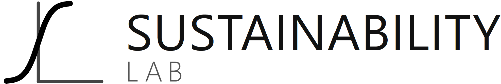
    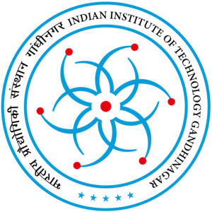
    <div class="title-qr">
      
      <span>Project page</span>
    </div>
  </div>
</div>

# NILMBench2026

<p class="title-sub">A deployment-aware benchmark for energy disaggregation</p>
<div class="title-badge"> Best Paper Candidate</div>
<div class="title-rule"></div>

<div class="author-row">
  <div class="a">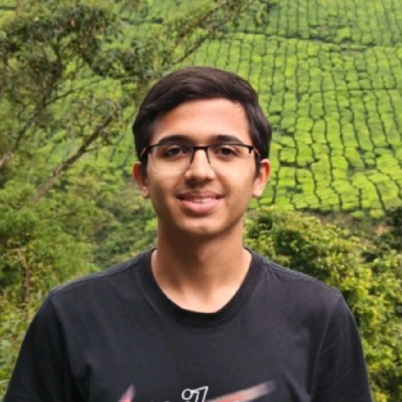<div class="n">Aayush Kuloor*</div><div class="role">Undergraduate Sophomore<br>IIT Gandhinagar</div><div class="e">aayush.kuloor@iitgn.ac.in</div></div>
  <div class="a">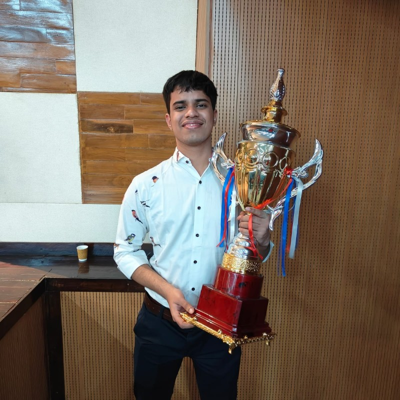<div class="n">Anurag Singh*</div><div class="role">Undergraduate Sophomore<br>IIT Gandhinagar</div><div class="e">anurag.s@iitgn.ac.in</div></div>
  <div class="a">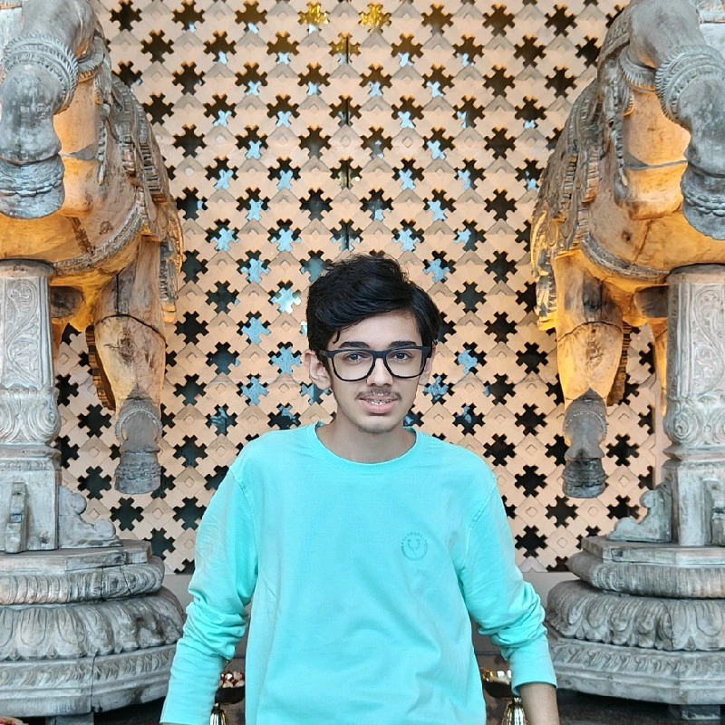<div class="n">Harsh Dhru*</div><div class="role">Undergraduate Sophomore<br>IIT Gandhinagar</div><div class="e">harsh.dhru@iitgn.ac.in</div></div>
  <div class="a advisor"><div class="n">Nipun Batra</div><div class="role">Faculty advisor<br>IIT&nbsp;Gandhinagar</div><div class="e">nipun.batra@iitgn.ac.in</div></div>
</div>

<p class="title-meta">ACM BuildSys 2026 · Banff, Canada</p>

---

<!-- Slide 2 is a 2-step build: aggregate signal first, then the full
     disaggregation. Edit both copies to keep them in sync. -->
<div class="kick">Motivation</div>

## NILM turns one meter into appliance-level estimates

<div class="slide-body">

<div class="vc decomp-layout">
<div class="fig-col">

</div>
<div class="txt-col">
<ul>
<li><strong>One</strong> aggregate smart-meter signal — all that is measured at deployment</li>
<li class="fade">Disaggregates into appliance-level power — no per-appliance sensors</li>
<li class="fade">Feedback can cut household use by up to 15% (Froehlich &amp; Patel 2011; Darby 2006)</li>
<li class="fade">Signatures vary across homes and devices</li>
</ul>
<p class="decomp-aside">Real data · UK-DALE house 1<br>time (x) vs power in W (y)</p>
</div>
</div>

</div>

---

<div class="kick">Motivation</div>

## NILM turns one meter into appliance-level estimates

<div class="slide-body">

<div class="vc decomp-layout">
<div class="fig-col">
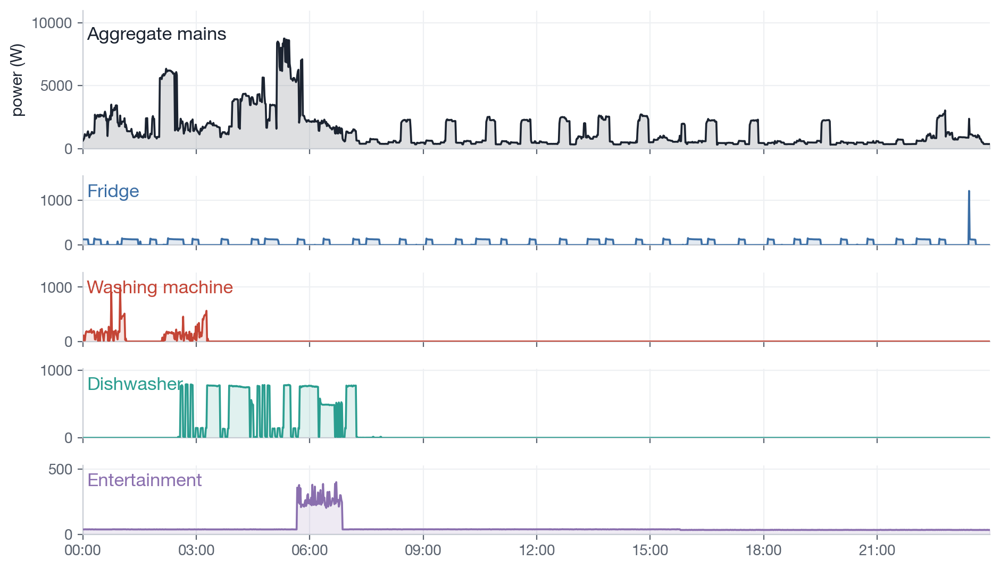
</div>
<div class="txt-col">
<ul>
<li><strong>One</strong> aggregate smart-meter signal — all that is measured at deployment</li>
<li>Disaggregates into appliance-level power — no per-appliance sensors</li>
<li>Feedback can cut household use by up to 15% (Froehlich &amp; Patel 2011; Darby 2006)</li>
<li>Signatures vary across homes and devices</li>
</ul>
<p class="decomp-aside">Real data · UK-DALE house 1<br>time (x) vs power in W (y)</p>
</div>
</div>

</div>

---

<!-- Slide 3 is a 3-step build: spotlight fridge -> washer -> dishwasher.
     Edit all three copies to keep them in sync. -->
<div class="kick">Motivation</div>

## Appliance signatures differ by load type

<div class="slide-body">

<div class="sig-grid">
<div class="sig-panel on">
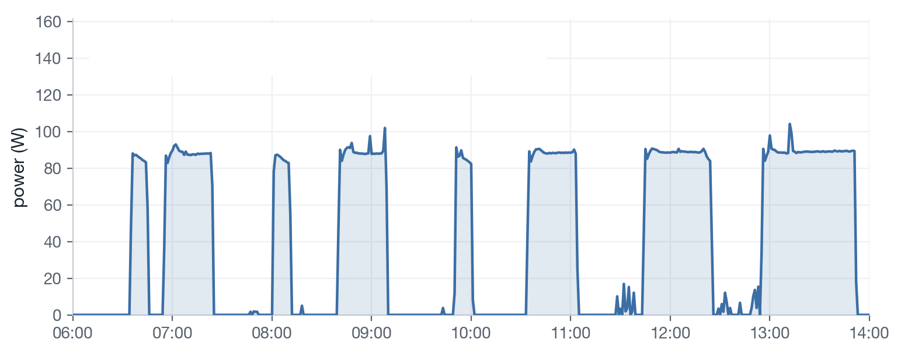
<div class="sig-label">Fridge · periodic</div>
<ul>
<li>Compressor cycles ~80–120 W</li>
<li><strong>Defrost spikes</strong> on longer horizon</li>
<li>Always-on, easy to detect</li>
</ul>
</div>
<div class="sig-panel">
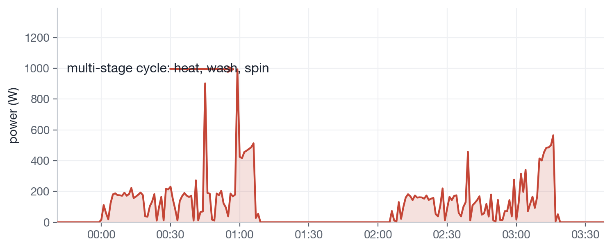
<div class="sig-label">Washing machine · multi-stage</div>
<ul>
<li><strong>Heat → agitate → spin</strong></li>
<li>Long, variable duration</li>
<li>Many sub-states</li>
</ul>
</div>
<div class="sig-panel">
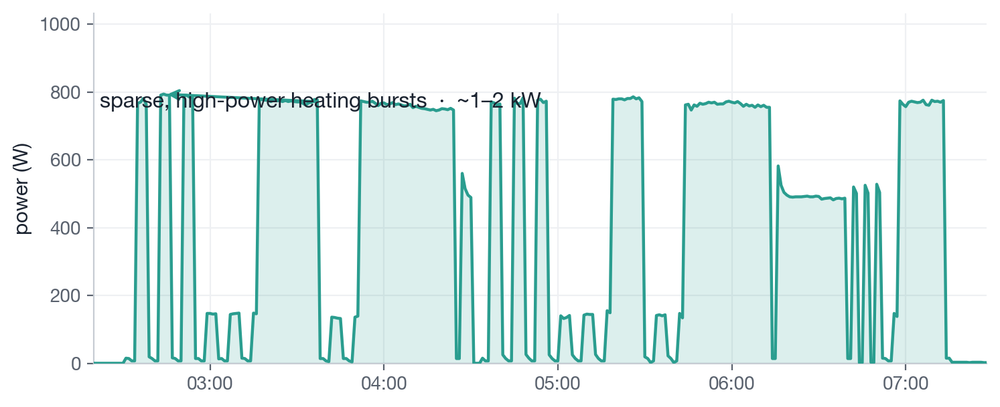
<div class="sig-label">Dishwasher · sparse / bursty</div>
<ul>
<li>High-power heating bursts</li>
<li>Long idle gaps</li>
<li><strong>MAE-deceptive</strong> when mostly off</li>
</ul>
</div>
</div>

</div>

---

<div class="kick">Motivation</div>

## Appliance signatures differ by load type

<div class="slide-body">

<div class="sig-grid">
<div class="sig-panel seen">

<div class="sig-label">Fridge · periodic</div>
<ul>
<li>Compressor cycles ~80–120 W</li>
<li><strong>Defrost spikes</strong> on longer horizon</li>
<li>Always-on, easy to detect</li>
</ul>
</div>
<div class="sig-panel on">

<div class="sig-label">Washing machine · multi-stage</div>
<ul>
<li><strong>Heat → agitate → spin</strong></li>
<li>Long, variable duration</li>
<li>Many sub-states</li>
</ul>
</div>
<div class="sig-panel">

<div class="sig-label">Dishwasher · sparse / bursty</div>
<ul>
<li>High-power heating bursts</li>
<li>Long idle gaps</li>
<li><strong>MAE-deceptive</strong> when mostly off</li>
</ul>
</div>
</div>

</div>

---

<div class="kick">Motivation</div>

## Appliance signatures differ by load type

<div class="slide-body">

<div class="sig-grid">
<div class="sig-panel seen">

<div class="sig-label">Fridge · periodic</div>
<ul>
<li>Compressor cycles ~80–120 W</li>
<li><strong>Defrost spikes</strong> on longer horizon</li>
<li>Always-on, easy to detect</li>
</ul>
</div>
<div class="sig-panel seen">

<div class="sig-label">Washing machine · multi-stage</div>
<ul>
<li><strong>Heat → agitate → spin</strong></li>
<li>Long, variable duration</li>
<li>Many sub-states</li>
</ul>
</div>
<div class="sig-panel on">

<div class="sig-label">Dishwasher · sparse / bursty</div>
<ul>
<li>High-power heating bursts</li>
<li>Long idle gaps</li>
<li><strong>MAE-deceptive</strong> when mostly off</li>
</ul>
</div>
</div>

</div>

---

<!-- Slide 4 is a 4-step build: the spotlight moves across the four eras
     (Combinatorial → Probabilistic → Deep learning → Transformers) as you
     speak. Edit the era text in ALL FOUR copies below to keep them in sync. -->

<!-- _class: evo-slide -->

<div class="kick">Background</div>

## NILM methods evolved, but evaluation did not

<div class="slide-body tight">

<div class="evo-wrap">
<div class="evo-stage">
<div class="evo-step on">
<div class="era">1980s–90s</div>
<div class="name">Combinatorial</div>
<div class="fig-box"></div>
<ul><li>Edge matching</li><li>Breaks on variable loads</li></ul>
</div>
<div class="evo-step">
<div class="era">2000s</div>
<div class="name">Probabilistic</div>
<div class="fig-box"></div>
<ul><li>Hidden appliance states</li><li>Poor scaling</li></ul>
</div>
<div class="evo-step">
<div class="era">2015+</div>
<div class="name">Deep learning</div>
<div class="fig-box"></div>
<ul><li>Seq2Point CNNs</li><li>Strong same-home fit</li></ul>
</div>
<div class="evo-step">
<div class="era">2020+</div>
<div class="name">Transformers</div>
<div class="fig-box"></div>
<ul><li>Long-range context</li><li>Higher compute</li></ul>
</div>
</div>

<div class="callout evo-callout"><strong>Models changed — evaluation did not.</strong> Same-home accuracy became the default; cross-building and cross-dataset tests lagged behind.</div>

</div>

</div>

---

<!-- _class: evo-slide -->

<div class="kick">Background</div>

## NILM methods evolved, but evaluation did not

<div class="slide-body tight">

<div class="evo-wrap">
<div class="evo-stage">
<div class="evo-step seen">
<div class="era">1980s–90s</div>
<div class="name">Combinatorial</div>
<div class="fig-box"></div>
<ul><li>Edge matching</li><li>Breaks on variable loads</li></ul>
</div>
<div class="evo-step on">
<div class="era">2000s</div>
<div class="name">Probabilistic</div>
<div class="fig-box"></div>
<ul><li>Hidden appliance states</li><li>Poor scaling</li></ul>
</div>
<div class="evo-step">
<div class="era">2015+</div>
<div class="name">Deep learning</div>
<div class="fig-box"></div>
<ul><li>Seq2Point CNNs</li><li>Strong same-home fit</li></ul>
</div>
<div class="evo-step">
<div class="era">2020+</div>
<div class="name">Transformers</div>
<div class="fig-box"></div>
<ul><li>Long-range context</li><li>Higher compute</li></ul>
</div>
</div>

<div class="callout evo-callout"><strong>Models changed — evaluation did not.</strong> Same-home accuracy became the default; cross-building and cross-dataset tests lagged behind.</div>

</div>

</div>

---

<!-- _class: evo-slide -->

<div class="kick">Background</div>

## NILM methods evolved, but evaluation did not

<div class="slide-body tight">

<div class="evo-wrap">
<div class="evo-stage">
<div class="evo-step seen">
<div class="era">1980s–90s</div>
<div class="name">Combinatorial</div>
<div class="fig-box"></div>
<ul><li>Edge matching</li><li>Breaks on variable loads</li></ul>
</div>
<div class="evo-step seen">
<div class="era">2000s</div>
<div class="name">Probabilistic</div>
<div class="fig-box"></div>
<ul><li>Hidden appliance states</li><li>Poor scaling</li></ul>
</div>
<div class="evo-step on">
<div class="era">2015+</div>
<div class="name">Deep learning</div>
<div class="fig-box"></div>
<ul><li>Seq2Point CNNs</li><li>Strong same-home fit</li></ul>
</div>
<div class="evo-step">
<div class="era">2020+</div>
<div class="name">Transformers</div>
<div class="fig-box"></div>
<ul><li>Long-range context</li><li>Higher compute</li></ul>
</div>
</div>

<div class="callout evo-callout"><strong>Models changed — evaluation did not.</strong> Same-home accuracy became the default; cross-building and cross-dataset tests lagged behind.</div>

</div>

</div>

---

<!-- _class: evo-slide -->

<div class="kick">Background</div>

## NILM methods evolved, but evaluation did not

<div class="slide-body tight">

<div class="evo-wrap">
<div class="evo-stage">
<div class="evo-step seen">
<div class="era">1980s–90s</div>
<div class="name">Combinatorial</div>
<div class="fig-box"></div>
<ul><li>Edge matching</li><li>Breaks on variable loads</li></ul>
</div>
<div class="evo-step seen">
<div class="era">2000s</div>
<div class="name">Probabilistic</div>
<div class="fig-box"></div>
<ul><li>Hidden appliance states</li><li>Poor scaling</li></ul>
</div>
<div class="evo-step seen">
<div class="era">2015+</div>
<div class="name">Deep learning</div>
<div class="fig-box"></div>
<ul><li>Seq2Point CNNs</li><li>Strong same-home fit</li></ul>
</div>
<div class="evo-step on">
<div class="era">2020+</div>
<div class="name">Transformers</div>
<div class="fig-box"></div>
<ul><li>Long-range context</li><li>Higher compute</li></ul>
</div>
</div>

<div class="callout evo-callout on"><strong>Models changed — evaluation did not.</strong> Same-home accuracy became the default; cross-building and cross-dataset tests lagged behind.</div>

</div>

</div>

---

<div class="kick">Why a new benchmark</div>

## Existing benchmarks missed deployment readiness

<div class="slide-body">

| Capability | NILMTK<br><span class="note">e-Energy 2014</span> | NILMTK-Contrib<br><span class="note">BuildSys 2019</span> | NILMBench2026<br><span class="note">BuildSys 2026</span> |
|---|---|---|---|
| Models | 2 | 9 | **16** |
| Resolutions | variable | 1-min | **1-min & 15-min** |
| Efficiency (FLOPs / time) | — | — | **yes** |
| Cross-building | — | yes | yes |
| Cross-dataset | — | — | **yes** |
| Stack | Python 2.7 | TF 1.x | **PyTorch + Docker + uv** |

<p class="callout" style="margin-top:16px;font-size:18px">First benchmark to jointly score <strong>efficiency</strong>, <strong>multi-resolution</strong> utility settings, and <strong>cross-domain transfer</strong>.</p>

</div>

---

<div class="kick">The benchmark · data</div>

## Datasets cover countries, buildings, and appliance types

<div class="slide-body tight">

<div class="dataset-wrap">

| Dataset | Country | Buildings | Duration | Appliances |
|---|---|---|---|---|
| **REDD** | USA — 110 V | 6 | 3–19 days | 10–20 |
| **UK-DALE** | UK — 230 V | 5 | 655 days | 5–54 |
| **REFIT** | UK — 230 V | 20 | 2 years | 9–21 |

</div>

<div class="formal-list">
<div class="item"><strong>Periodic</strong><span>Fridge, television</span></div>
<div class="item"><strong>Sparse / bursty</strong><span>Microwave, kettle, dishwasher</span></div>
<div class="item"><strong>Multi-stage</strong><span>Washing machine, dishwasher</span></div>
</div>

</div>

---

<!-- Goals 2/3 is a 2-step build: spotlight relevance, then coverage.
     Edit both copies to keep them in sync. -->
<!-- _class: design-slide -->

<div class="kick">The benchmark · design</div>

## Design goal 1 — Reproducible ML tooling

<div class="slide-body">

<div class="design-body">
<div class="design-panel">
<h4>Motivation</h4>
<ul>
<li>Legacy NILMTK stacks were brittle — Python&nbsp;2.7, TensorFlow&nbsp;1.x, broken installs</li>
<li>Hard to reproduce published numbers or compare new models fairly</li>
</ul>
<div class="fig-box">

</div>
</div>
<div class="design-panel do">
<h4>What we do</h4>
<ul>
<li>Re-implement legacy models in <strong>PyTorch</strong> under a unified API</li>
<li>Ship sealed runs with <strong>Docker</strong> and <strong>uv</strong></li>
<li>Extend the NILMTK Experiment API so every model follows the same train / test protocol</li>
</ul>
</div>
</div>

<div class="callout design-callout"><strong>Goal:</strong> a new architecture should take <strong>minutes to benchmark</strong>, not days to debug the install.</div>

</div>

---

<!-- _class: design-slide -->

<div class="kick">The benchmark · design</div>

## Design goals 2 &amp; 3 — What we evaluate

<div class="slide-body">

<div class="design-duo">
<div class="design-goal on">
<p class="goal-title">2 · Real-world relevance</p>
<div class="goal-block">
<h4>Motivation</h4>
<ul>
<li>NILM at <strong>user-feedback</strong> and <strong>utility-scale</strong> timescales</li>
<li>Deployment = new homes, regions, grid conditions</li>
</ul>
</div>
<div class="goal-block">
<h4>What we do</h4>
<ul>
<li><strong>1-min</strong> &amp; <strong>15-min</strong> on REDD, UK-DALE, REFIT</li>
<li>Sealed <strong>cross-building</strong> &amp; <strong>cross-dataset</strong> splits</li>
<li>Regression <strong>MAE</strong> + event <strong>F1</strong> for sparse loads</li>
</ul>
</div>
</div>
<div class="design-goal">
<p class="goal-title">3 · Comprehensive coverage</p>
<div class="goal-block">
<h4>Motivation</h4>
<ul>
<li>Prior work: few models, <strong>accuracy only</strong></li>
<li>Deployment needs efficiency &amp; event detection too</li>
</ul>
</div>
<div class="goal-block">
<h4>What we do</h4>
<ul>
<li><strong>16 models</strong> · recurrent, conv, attention, hybrid</li>
<li><strong>MAE</strong>, <strong>F1</strong>, <strong>parameters</strong>, <strong>FLOPs</strong> — one protocol</li>
<li>First to combine multi-resolution, efficiency &amp; transfer</li>
</ul>
</div>
</div>
</div>

</div>

---

<!-- _class: design-slide -->

<div class="kick">The benchmark · design</div>

## Design goals 2 &amp; 3 — What we evaluate

<div class="slide-body">

<div class="design-duo">
<div class="design-goal seen">
<p class="goal-title">2 · Real-world relevance</p>
<div class="goal-block">
<h4>Motivation</h4>
<ul>
<li>NILM at <strong>user-feedback</strong> and <strong>utility-scale</strong> timescales</li>
<li>Deployment = new homes, regions, grid conditions</li>
</ul>
</div>
<div class="goal-block">
<h4>What we do</h4>
<ul>
<li><strong>1-min</strong> &amp; <strong>15-min</strong> on REDD, UK-DALE, REFIT</li>
<li>Sealed <strong>cross-building</strong> &amp; <strong>cross-dataset</strong> splits</li>
<li>Regression <strong>MAE</strong> + event <strong>F1</strong> for sparse loads</li>
</ul>
</div>
</div>
<div class="design-goal on">
<p class="goal-title">3 · Comprehensive coverage</p>
<div class="goal-block">
<h4>Motivation</h4>
<ul>
<li>Prior work: few models, <strong>accuracy only</strong></li>
<li>Deployment needs efficiency &amp; event detection too</li>
</ul>
</div>
<div class="goal-block">
<h4>What we do</h4>
<ul>
<li><strong>16 models</strong> · recurrent, conv, attention, hybrid</li>
<li><strong>MAE</strong>, <strong>F1</strong>, <strong>parameters</strong>, <strong>FLOPs</strong> — one protocol</li>
<li>First to combine multi-resolution, efficiency &amp; transfer</li>
</ul>
</div>
</div>
</div>

</div>

---

<!-- _class: demo -->
<!-- _paginate: false -->
<!-- _footer: '' -->

<div class="demo-panel">
<div class="big">Live demo</div>
<div class="sub">Run one sealed benchmark task, inspect MAE / F1 / efficiency metrics, then return to the results.</div>
</div>

---

<!-- T1/T2/T3 is a 3-step build: spotlight T1 -> T2 -> T3.
     Edit all three copies to keep them in sync. -->
<div class="kick">The benchmark</div>

## Three tasks separate fitting from deployment

<div class="slide-body">

<div class="task-row">
<div class="task-card on">

<div class="tt">T1 · Same building</div>
<div class="meta">
<div><span class="tl">Setup</span>Disjoint time windows, one home</div>
<div><span class="tl">Split</span>Train 30 day (B1) → test 1 week (B1)</div>
<div><span class="tl">Role</span>Upper-bound sanity check</div>
</div>
</div>
<div class="task-card">

<div class="tt">T2 · New building</div>
<div class="meta">
<div><span class="tl">Setup</span>Train on homes, test on unseen home</div>
<div><span class="tl">Split</span>UK-DALE B1,B2 → B4 · REDD B1–B3 → B6</div>
<div><span class="tl">Role</span>Cross-building generalization</div>
</div>
</div>
<div class="task-card">

<div class="tt">T3 · New dataset</div>
<div class="meta">
<div><span class="tl">Setup</span>Train in one country, test in another</div>
<div><span class="tl">Split</span>REDD (USA, 110 V) ⇄ REFIT (UK, 230 V)</div>
<div><span class="tl">Role</span>Zero-shot domain shift</div>
</div>
</div>
</div>

</div>

---

<div class="kick">The benchmark</div>

## Three tasks separate fitting from deployment

<div class="slide-body">

<div class="task-row">
<div class="task-card seen">

<div class="tt">T1 · Same building</div>
<div class="meta">
<div><span class="tl">Setup</span>Disjoint time windows, one home</div>
<div><span class="tl">Split</span>Train 30 day (B1) → test 1 week (B1)</div>
<div><span class="tl">Role</span>Upper-bound sanity check</div>
</div>
</div>
<div class="task-card on">

<div class="tt">T2 · New building</div>
<div class="meta">
<div><span class="tl">Setup</span>Train on homes, test on unseen home</div>
<div><span class="tl">Split</span>UK-DALE B1,B2 → B4 · REDD B1–B3 → B6</div>
<div><span class="tl">Role</span>Cross-building generalization</div>
</div>
</div>
<div class="task-card">

<div class="tt">T3 · New dataset</div>
<div class="meta">
<div><span class="tl">Setup</span>Train in one country, test in another</div>
<div><span class="tl">Split</span>REDD (USA, 110 V) ⇄ REFIT (UK, 230 V)</div>
<div><span class="tl">Role</span>Zero-shot domain shift</div>
</div>
</div>
</div>

</div>

---

<div class="kick">The benchmark</div>

## Three tasks separate fitting from deployment

<div class="slide-body">

<div class="task-row">
<div class="task-card seen">

<div class="tt">T1 · Same building</div>
<div class="meta">
<div><span class="tl">Setup</span>Disjoint time windows, one home</div>
<div><span class="tl">Split</span>Train 30 day (B1) → test 1 week (B1)</div>
<div><span class="tl">Role</span>Upper-bound sanity check</div>
</div>
</div>
<div class="task-card seen">

<div class="tt">T2 · New building</div>
<div class="meta">
<div><span class="tl">Setup</span>Train on homes, test on unseen home</div>
<div><span class="tl">Split</span>UK-DALE B1,B2 → B4 · REDD B1–B3 → B6</div>
<div><span class="tl">Role</span>Cross-building generalization</div>
</div>
</div>
<div class="task-card on">

<div class="tt">T3 · New dataset</div>
<div class="meta">
<div><span class="tl">Setup</span>Train in one country, test in another</div>
<div><span class="tl">Split</span>REDD (USA, 110 V) ⇄ REFIT (UK, 230 V)</div>
<div><span class="tl">Role</span>Zero-shot domain shift</div>
</div>
</div>
</div>

</div>

---

<!-- Finding 1 is a 3-step build: reveal one bar at a time; the jump arrow
     and the takeaways land on step 3. Edit all three copies to keep in sync. -->
<div class="kick">Results</div>

## Finding 1 — Domain shift drives the largest error jump

<div class="slide-body">

<div class="vc">
<div class="fig-col">
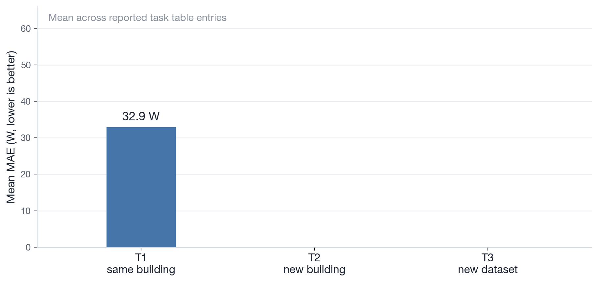
</div>
<div class="txt-col">
<ul>
<li class="fade">Mean MAE rises from <strong>T1 → T2 → T3</strong> (UK-DALE / REDD→REFIT splits)</li>
<li class="fade">Same-home accuracy is <strong>not</strong> a deployment metric</li>
<li class="fade">Cross-dataset transfer is the hardest stress test</li>
</ul>
</div>
</div>

<div class="callout callout-full fade">Use T1 as a sanity check; deployment claims need <strong>T2 and T3</strong>.</div>

</div>

---

<div class="kick">Results</div>

## Finding 1 — Domain shift drives the largest error jump

<div class="slide-body">

<div class="vc">
<div class="fig-col">
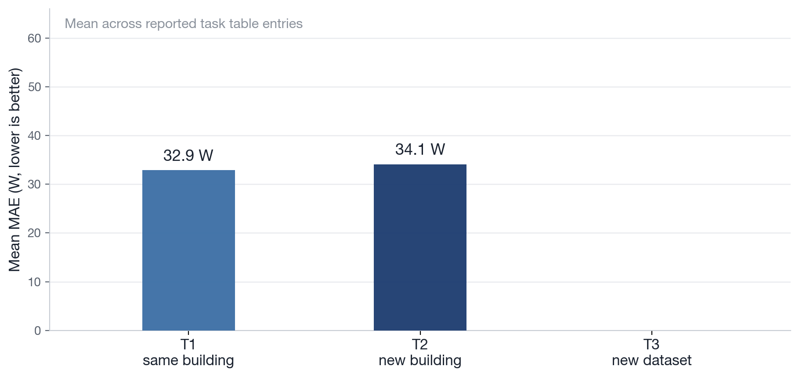
</div>
<div class="txt-col">
<ul>
<li class="fade">Mean MAE rises from <strong>T1 → T2 → T3</strong> (UK-DALE / REDD→REFIT splits)</li>
<li class="fade">Same-home accuracy is <strong>not</strong> a deployment metric</li>
<li class="fade">Cross-dataset transfer is the hardest stress test</li>
</ul>
</div>
</div>

<div class="callout callout-full fade">Use T1 as a sanity check; deployment claims need <strong>T2 and T3</strong>.</div>

</div>

---

<div class="kick">Results</div>

## Finding 1 — Domain shift drives the largest error jump

<div class="slide-body">

<div class="vc">
<div class="fig-col">
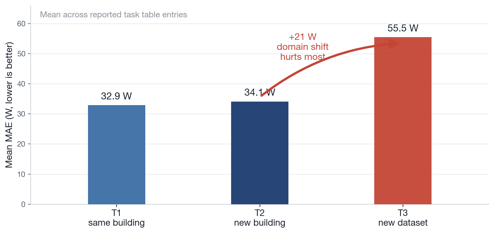
</div>
<div class="txt-col">
<ul>
<li>Mean MAE rises from <strong>T1 → T2 → T3</strong> (UK-DALE / REDD→REFIT splits)</li>
<li>Same-home accuracy is <strong>not</strong> a deployment metric</li>
<li>Cross-dataset transfer is the hardest stress test</li>
</ul>
</div>
</div>

<div class="callout callout-full">Use T1 as a sanity check; deployment claims need <strong>T2 and T3</strong>.</div>

</div>

---

<div class="kick">Results</div>

## Finding 2 — MAE hides missed events

<div class="slide-body tight">


<ul style="margin-top:8px">
<li>Predict ≈ 0 during long idle periods → <strong>deceptively low MAE</strong></li>
<li><strong>NILMFormer &amp; Seq2Seq</strong> miss every microwave spike on REFIT T2</li>
<li>Sparse, high-power loads need <strong>F1</strong>, not MAE alone</li>
</ul>

</div>

---

<div class="kick">Results</div>

## Finding 3 — More compute ≠ better

<div class="slide-body">

<div class="vc">
<div class="fig-col">
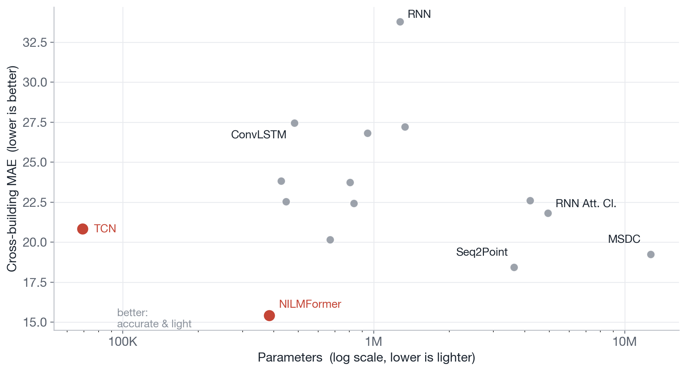
</div>
<div class="txt-col">
<ul>
<li>Trade-off is <strong>non-monotonic</strong> — size alone does not predict deployment quality</li>
<li><strong>TCN</strong> (69K params) matches much heavier models on T2</li>
<li><strong>NILMFormer</strong> (383K) leads on hard generalization tasks</li>
<li><strong>RNN Att. Cl.</strong> (4.9M) is expensive <em>and</em> worse on average</li>
</ul>
<div class="callout" style="margin-top:10px;font-size:17px">Architectural inductive bias matters more than parameter count.</div>
</div>
</div>

</div>

---

<!-- _class: platform -->

<div class="kick">The platform</div>

## A new model should take minutes to benchmark

<div class="slide-body tight">

<div class="leader-stack">
<div class="leader leader-top">
<div>

```python
class PatchTSTDisaggregator(Disaggregator):
    def partial_fit(self, train_main, train_appliances):
        self.model.fit(train_main, train_appliances)

    def disaggregate_chunk(self, mains):
        return self.model.predict(mains)
```

</div>
<div class="copy">
<ul>
<li>Wrap any PyTorch time-series model in the NILMTK-Contrib API</li>
<li>Run sealed <strong>T1 / T2 / T3</strong> experiment configs</li>
<li>Report <strong>MAE</strong>, <strong>F1</strong>, parameters, FLOPs, and runtime together</li>
</ul>
</div>
</div>

<div class="callout callout-full">Code: <strong>github.com/nilmtk/nilmtk-contrib</strong> · Docker + uv for reproducible installs</div>

</div>

</div>

---

<!-- _class: outlook-slide -->

<div class="kick">Summary &amp; outlook</div>

## Summary and future directions

<div class="slide-body outlook-slide">

<div class="outlook-grid">
<div class="outlook-copy">
<div>

<h4>What we learned</h4>
<ul>
<li>Same-home accuracy is not enough</li>
<li>MAE can reward missed sparse events</li>
<li>More parameters do not guarantee better deployment</li>
</ul>

</div>
<div>

<h4>Proposed future directions</h4>
<ul>
<li>Public, OOD-first leaderboard for the community</li>
<li><strong>KDD-Cup-style</strong> NILM challenge</li>
<li>Agent-assisted model onboarding</li>
<li>Domain adaptation for new homes</li>
</ul>

</div>
</div>
<div>

</div>
</div>

<p class="outlook-link">Project page · <a href="https://sustainability-lab.github.io/nilmbench/">sustainability-lab.github.io/nilmbench</a></p>
<div class="outlook-qr"></div>

</div>
