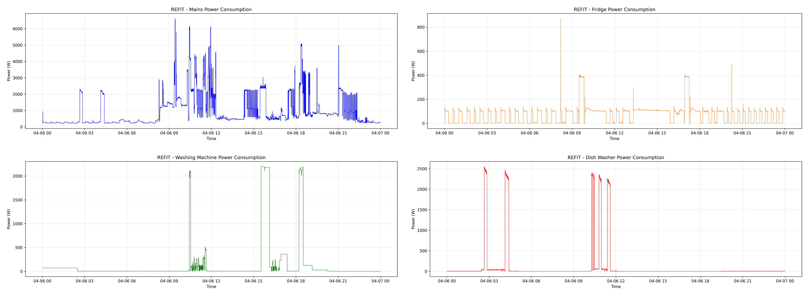

<style>
@import url('https://fonts.googleapis.com/css2?family=Playfair+Display:wght@600;700;800&family=Work+Sans:wght@300;400;500;600;700&family=JetBrains+Mono:wght@400;500&display=swap');

:root{
  --ink:#1b2330; --ink2:#48515e; --mut:#8b929c;
  --acc:#c44536; --navy:#1b3b6f;
  --line:#e6e8ec; --paper:#ffffff; --paper2:#f7f7f5;
}
section{
  background:var(--paper); color:var(--ink);
  font-family:'Work Sans',sans-serif; font-size:23px; line-height:1.5;
  padding:58px 78px;
}
section::after{ color:var(--mut); font-family:'Work Sans',sans-serif; font-size:13px; right:34px; }
footer{ color:var(--mut); font-family:'Work Sans',sans-serif; font-size:13px; }

h1{ font-family:'Playfair Display',serif; font-weight:800; font-size:46px; color:var(--ink); margin:0 0 16px; letter-spacing:-0.01em; line-height:1.08; }
h2{ font-family:'Playfair Display',serif; font-weight:700; font-size:37px; color:var(--ink); margin:0 0 24px; letter-spacing:-0.01em;
    padding-bottom:14px; border-bottom:1px solid var(--line); position:relative; }
h2::after{ content:''; position:absolute; left:0; bottom:-1px; width:62px; height:3px; background:var(--acc); }
h3{ font-family:'Work Sans',sans-serif; font-weight:700; font-size:21px; margin:0 0 5px; color:var(--ink); }
h4{ font-family:'Work Sans',sans-serif; font-weight:600; font-size:13px; letter-spacing:0.16em; text-transform:uppercase; color:var(--acc); margin:0 0 14px; }
strong{ color:var(--ink); font-weight:700; }
em{ color:var(--acc); font-style:normal; font-weight:600; }
a{ color:var(--acc); text-decoration:none; }
p{ margin:0 0 14px; }

ul{ margin:6px 0; padding-left:0; list-style:none; }
li{ margin:13px 0; padding-left:26px; position:relative; color:var(--ink2); }
li strong{ color:var(--ink); }
li::before{ content:''; position:absolute; left:2px; top:11px; width:7px; height:7px; border-radius:50%; border:2px solid var(--acc); }

code{ font-family:'JetBrains Mono',monospace; font-size:.82em; color:var(--navy); background:#eef1f5; padding:2px 6px; border-radius:4px; }
pre{ background:#f6f7f9; border:1px solid var(--line); border-radius:10px; padding:18px 22px; font-size:17px; line-height:1.65; }
pre code{ background:none; color:var(--ink); padding:0; font-size:1em; }
.hljs-keyword,.hljs-built_in,.hljs-meta{ color:var(--acc); }
.hljs-string{ color:#1f7a4d; }
.hljs-comment{ color:#9aa1ac; font-style:italic; }
.hljs-number,.hljs-literal{ color:var(--navy); }
.hljs-title,.hljs-class .hljs-title,.hljs-title.class_,.hljs-title.function_{ color:#9a5b00; }

table{ border-collapse:collapse; font-size:19px; width:100%; }
th{ font-family:'Work Sans',sans-serif; font-weight:600; color:var(--ink); padding:10px 14px; text-align:left;
    border-bottom:2px solid var(--ink); font-size:13.5px; text-transform:uppercase; letter-spacing:0.05em; }
td{ padding:9px 14px; border-bottom:1px solid var(--line); color:var(--ink2); }
tr:last-child td{ border-bottom:none; }
td strong{ color:var(--acc); }

img{ display:block; margin:0 auto; }

.cols{ display:flex; gap:30px; align-items:flex-start; }
.col{ flex:1; }
.vc{ display:flex; align-items:center; gap:34px; }
.note{ color:var(--mut); font-size:17px; }
.kpis{ display:flex; gap:0; margin:10px 0 22px; }
.kpi{ flex:1; padding:0 18px; border-left:1px solid var(--line); }
.kpi:first-child{ border-left:none; padding-left:0; }
.kpi .n{ font-family:'Playfair Display',serif; font-weight:800; font-size:52px; color:var(--ink); line-height:1; }
.kpi .n em{ color:var(--acc); }
.kpi .l{ color:var(--ink2); font-size:16px; margin-top:8px; }
.lead{ font-size:25px; color:var(--ink2); max-width:90%; }
.lead strong{ color:var(--ink); }

.stage{ display:flex; align-items:stretch; gap:0; margin-top:18px; }
.stage .s{ flex:1; padding:16px 14px; border-top:3px solid var(--line); }
.stage .s.on{ border-top-color:var(--acc); }
.stage .s .y{ font-family:'JetBrains Mono',monospace; font-size:14px; color:var(--mut); }
.stage .s .t{ font-weight:600; font-size:18px; color:var(--ink); margin-top:3px; }
.stage .s .d{ font-size:14.5px; color:var(--ink2); margin-top:3px; }

.callout{ background:var(--paper2); border:1px solid var(--line); border-left:3px solid var(--acc); border-radius:8px; padding:16px 20px; font-size:20px; color:var(--ink2); }
.callout strong{ color:var(--ink); }

section.title{ text-align:center; padding-top:62px; }
section.title .logo{ height:38px; margin:0 auto 30px; opacity:.9; }
section.title h1{ font-size:78px; margin-bottom:10px; }
section.title .rule{ width:90px; height:3px; background:var(--acc); margin:0 auto 22px; }
section.title .sub{ font-family:'Playfair Display',serif; font-style:italic; font-size:27px; color:var(--ink2); margin-bottom:34px; }
section.title .auth{ font-size:23px; color:var(--ink); font-weight:600; }
section.title .mail{ font-family:'JetBrains Mono',monospace; font-size:14px; color:var(--mut); margin:8px 0 22px; }
section.title .aff{ font-size:18px; color:var(--ink2); }
section.title .conf{ font-size:17px; color:var(--mut); margin-top:6px; }
section.title .conf b{ color:var(--acc); font-weight:600; }

section.sec{ display:flex; flex-direction:column; justify-content:center; }
section.sec h1{ font-size:60px; max-width:88%; }
section.sec .k{ font-size:24px; color:var(--ink2); max-width:78%; margin-top:6px; }

.cap{ font-size:16px; color:var(--mut); text-align:center; margin-top:10px; }
</style>

<!-- _class: title -->
<!-- _paginate: false -->
<!-- _footer: '' -->


# NILMBench2026

<div class="rule"></div>

<div class="sub">A deployment-aware benchmark for energy disaggregation</div>

<div class="auth">Aayush Kuloor* &nbsp;·&nbsp; Anurag Singh* &nbsp;·&nbsp; Harsh Dhru* &nbsp;·&nbsp; Nipun Batra</div>
<div class="mail">{aayush.kuloor, anurag.s, harsh.dhru, nipun.batra}@iitgn.ac.in</div>
<div class="aff">Indian Institute of Technology Gandhinagar</div>
<div class="conf">ACM BuildSys 2026 · Banff, Canada &nbsp;|&nbsp; <b>Best Paper Candidate</b> &nbsp;|&nbsp; *equal contribution</div>

---

## What is NILM, and why does it matter?

<div class="vc">
<div style="flex:1.25">

Non-Intrusive Load Monitoring (NILM) converts a **single smart-meter signal**
into **appliance-level** consumption estimates.

$$ y_t = \sum_{i=1}^{N} x_{i,t} + \epsilon_t $$

- **Why it matters:** appliance-level feedback can reduce household consumption by up to **15%** — without installing a sensor on every device
- It is a hard **inverse problem**: appliance signatures vary across homes, making it a domain-adaptation challenge

</div>
<div style="flex:1">

<div class="cap">UK-DALE: aggregate mains disaggregated into appliances</div>
</div>
</div>

---

## Appliance signatures make disaggregation possible



<div class="note" style="text-align:center; margin-top:8px">Each appliance has a distinct electrical fingerprint — periodic (fridge), multi-stage (washing machine), or sparse and high-power (dishwasher).</div>

---

## The evolution of NILM

<div class="stage">
<div class="s"><div class="y">1980s–90s</div><div class="t">Combinatorial</div><div class="d">Hart's edge detection &amp; optimization</div></div>
<div class="s"><div class="y">2000s</div><div class="t">Probabilistic</div><div class="d">Factorial Hidden Markov Models</div></div>
<div class="s on"><div class="y">2015 →</div><div class="t">Deep learning</div><div class="d">CNNs, RNNs (Kelly &amp; Knottenbelt)</div></div>
<div class="s on"><div class="y">2020 →</div><div class="t">Transformers</div><div class="d">Long-range attention (NILMFormer)</div></div>
</div>

<br>

<div class="callout">As models grew more capable, evaluation did not keep pace. Benchmarking had to move <strong>beyond accuracy</strong> — to efficiency, resolution, and generalization.</div>

---

## What previous benchmarks missed

| Capability | NILMTK 2014 | Contrib 2019 | NILMBench2026 |
|---|---|---|---|
| Models | 2 | 9 | **16** |
| Temporal resolutions | variable | 1 min | **1 min and 15 min** |
| Efficiency metrics | — | — | **FLOPs, params, time** |
| Cross-building test | — | yes | yes |
| Cross-dataset transfer | — | — | **yes** |
| Software stack | Python 2.7 | TensorFlow 1.x | **PyTorch + Docker + uv** |

<div class="callout" style="margin-top:22px">Our contribution is a <strong>deployment stress test</strong> — not just another accuracy leaderboard.</div>

---

## NILMBench2026 at a glance

<div class="kpis">
<div class="kpi"><div class="n"><em>16</em></div><div class="l">models<br>classical → Transformer</div></div>
<div class="kpi"><div class="n"><em>3</em></div><div class="l">datasets<br>REDD · UK-DALE · REFIT</div></div>
<div class="kpi"><div class="n"><em>2</em></div><div class="l">resolutions<br>1-min &amp; 15-min</div></div>
<div class="kpi"><div class="n"><em>576</em></div><div class="l">configurations<br>16 × 3 × 2 × 6, ×3 runs</div></div>
</div>

<div class="callout"><strong>Evaluation philosophy.</strong> A deployable NILM model must be <strong>accurate</strong>, <strong>event-aware</strong>, <strong>transferable</strong>, and <strong>efficient</strong> — so we measure all four.</div>

---

## A modern, reproducible software stack

<div class="cols">
<div class="col">

#### Before
- Legacy TensorFlow / Keras implementations
- Environment drift across papers
- One-off model wrappers
- Accuracy-first reporting

</div>
<div class="col">

#### Now
- Standardized **PyTorch** implementations
- **Docker** and **uv** reproducibility
- A common **NILMTK-compatible** experiment API
- Accuracy, **event detection**, and **compute** metrics

</div>
</div>

```bash
uv pip install "nilmtk-contrib[torch] @ git+https://github.com/sustainability-lab/nilmbench.git"
```

---

## Systematic evaluation: three tasks

<div class="cols">
<div class="col">

<h3>T1 — Same building</h3>
<div class="note">Disjoint time windows from one home. A best-case baseline.</div>
</div>
<div class="col">

<h3>T2 — New building</h3>
<div class="note">Unseen home, same dataset. Deployment within a region.</div>
</div>
<div class="col">

<h3>T3 — New dataset</h3>
<div class="note">Train in one country, test in another. Zero-shot domain shift.</div>
</div>
</div>

---

## Datasets

| Dataset | Country | Buildings | Duration | Appliances |
|---|---|---|---|---|
| **REDD** | USA — 110 V | 6 | 3–19 days | 10–20 |
| **UK-DALE** | UK — 230 V | 5 | 655 days | 5–54 |
| **REFIT** | UK — 230 V | 20 | 2 years | 9–21 |

Six appliances span the difficulty range: **fridge, microwave, kettle, washing machine, dishwasher, television**.

<div class="note">Single-building (AMPds, iAWE, BLUED, DRED) and pay-walled (PecanStreet) datasets are excluded — they cannot support cross-building or cross-dataset evaluation.</div>

---

## Finding 1 — Generalization is the bottleneck

<div class="vc">
<div style="flex:1.05">

Accuracy degrades sharply from **T1 → T2 → T3**, symmetrically in both transfer directions.

- Models learn a **home-specific signature**, not a transferable appliance concept
- Right: NILMFormer tracks a television it was trained on (lower), but **fails on an unseen one** (upper)

<div class="callout" style="margin-top:14px">The same-building to unseen-building drop is the <strong>core barrier to real-world NILM</strong>.</div>

</div>
<div style="flex:.95">

</div>
</div>

---

## Finding 2 — MAE hides missed appliance events


<div class="note" style="text-align:center; margin-top:6px">REFIT microwave (cross-building): all four models miss every high-power activation, yet report a low MAE by predicting near-zero. A near-zero prediction can look acceptable in MAE while missing every event — so we also report <strong style="color:var(--ink)">F1</strong>.</div>

---

## Finding 3 — More compute does not guarantee better NILM

<div class="vc">
<div style="flex:1.2">

</div>
<div style="flex:.8">

The accuracy–compute trade-off is **non-monotonic**.

- **TCN** — 69K params — is competitive with far larger models
- **NILMFormer** — 383K params — is strongest overall
- **RNN Att. Cl.** — 4.94M params — is expensive *and* worse

<div class="note" style="margin-top:10px">Architectural inductive bias matters more than raw model size.</div>

</div>
</div>

---

## How a researcher can contribute

<div class="cols">
<div class="col">

```python
from nilmtk.disaggregate import Disaggregator

class MyNILM(Disaggregator):
    def partial_fit(self, mains, appliances): ...
    def disaggregate_chunk(self, mains): ...

experiment['methods']['MyNILM'] = MyNILM({})
```

```python
# nilmtk/losses.py — define once
def sae(gt, pred):
    return abs(pred.sum() - gt.sum()) / gt.sum()
experiment['test']['metrics'] += ['sae']
```

</div>
<div class="col">

A **new algorithm** is one class; a **new metric** is one function.

- The same frozen splits and pre-processing apply to every entry
- Reported gains reflect **architecture**, not implementation differences
- Results are directly comparable on a shared, open leaderboard

<div class="callout" style="margin-top:14px">NILMBench2026 turns new algorithms and datasets into <strong>comparable results</strong>, quickly.</div>

</div>
</div>

---

## NILMBench2026: a foundation for deployment

<div class="cols">
<div class="col">

#### Benchmark
16 models · 3 datasets · 2 resolutions · 576 configurations

#### Key finding
Generalization — not accuracy — is the main bottleneck

</div>
<div class="col">

#### Platform
PyTorch + Docker + uv + the NILMTK API

#### Next
Domain adaptation · self-supervised pre-training · edge-ready NILM

</div>
</div>

<br>

<div class="callout">
<strong>Code &amp; project page:</strong> github.com/sustainability-lab/nilmbench &nbsp;·&nbsp; sustainability-lab.github.io/nilmbench
</div>

---

<!-- _class: sec -->
<!-- _paginate: false -->

# Thank you.

<div class="k">Generalization is the bottleneck for real-world NILM. NILMBench2026 is the reproducible platform to measure — and close — that gap.</div>

<br>

<div class="note">nipun.batra@iitgn.ac.in &nbsp;·&nbsp; Sustainability Lab, IIT Gandhinagar &nbsp;·&nbsp; sustainability-lab.github.io/nilmbench</div>
