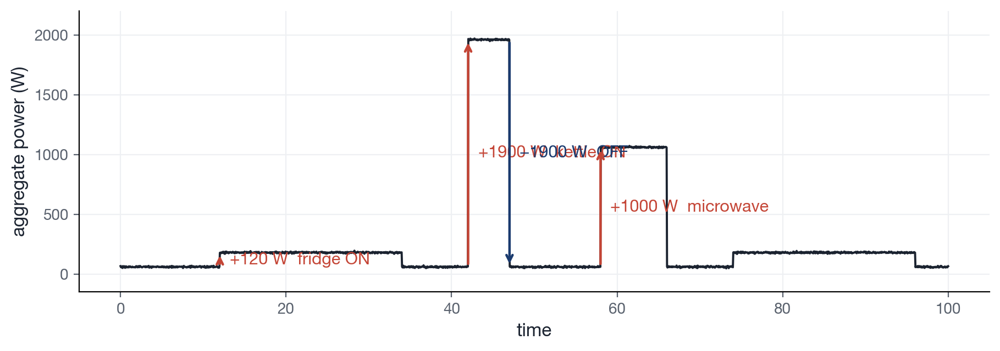
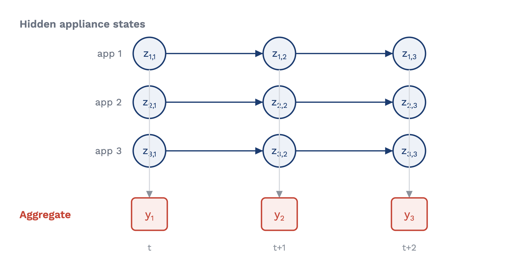
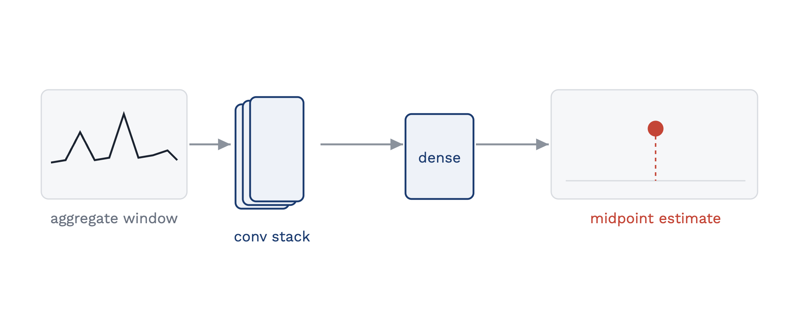
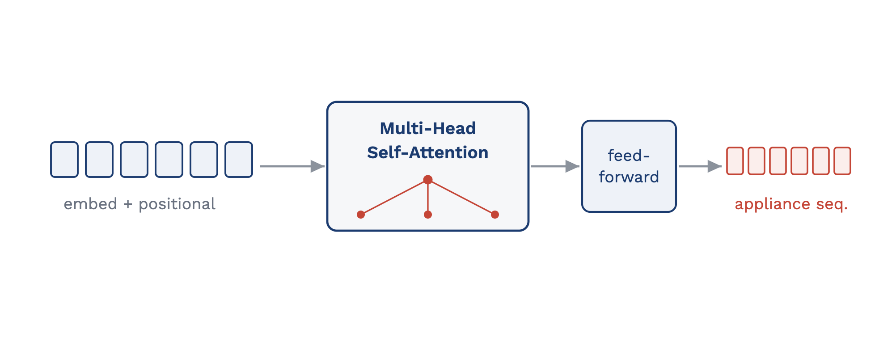
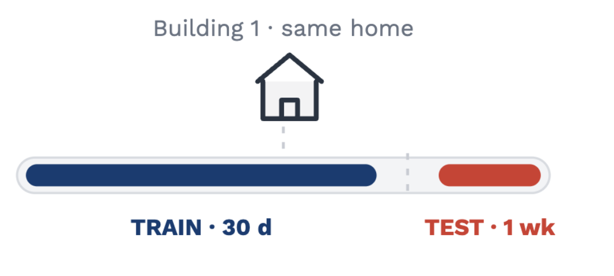
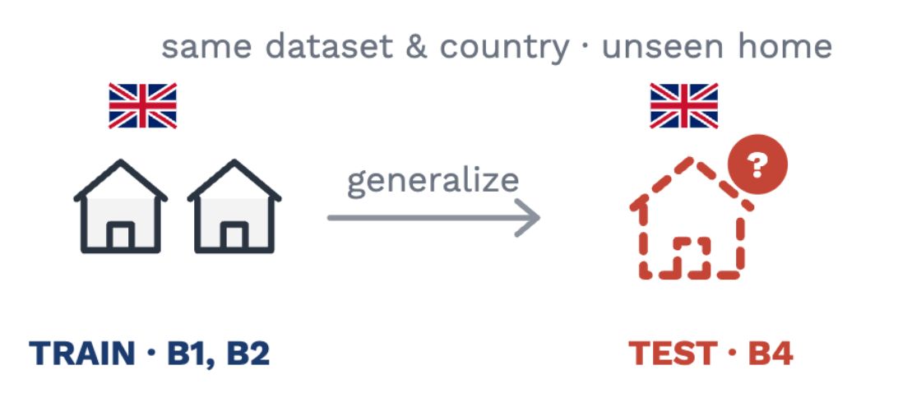
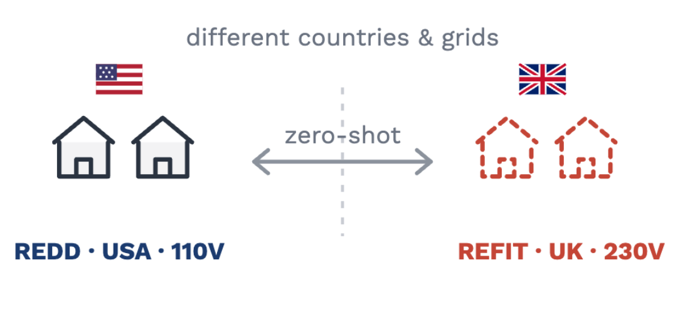

<svg width="0" height="0" style="position:absolute" aria-hidden="true"><defs>
<symbol id="ic-fridge" viewBox="0 0 24 24"><g fill="none" stroke="currentColor" stroke-width="1.7" stroke-linecap="round" stroke-linejoin="round"><rect x="6" y="2.5" width="12" height="19" rx="2.2"/><line x1="6" y1="9.5" x2="18" y2="9.5"/><line x1="9" y1="5" x2="9" y2="7"/><line x1="9" y1="12.5" x2="9" y2="15"/></g></symbol>
<symbol id="ic-washer" viewBox="0 0 24 24"><g fill="none" stroke="currentColor" stroke-width="1.7" stroke-linecap="round" stroke-linejoin="round"><rect x="4.5" y="3" width="15" height="18" rx="2.2"/><circle cx="12" cy="13.5" r="4.8"/><circle cx="12" cy="13.5" r="1.4"/><line x1="7" y1="6.2" x2="9" y2="6.2"/></g></symbol>
<symbol id="ic-dishwasher" viewBox="0 0 24 24"><g fill="none" stroke="currentColor" stroke-width="1.7" stroke-linecap="round" stroke-linejoin="round"><rect x="5" y="3" width="14" height="18" rx="2"/><line x1="5" y1="7.5" x2="19" y2="7.5"/><line x1="8" y1="5.2" x2="11" y2="5.2"/><rect x="8.5" y="10" width="7" height="8" rx="1"/></g></symbol>
<symbol id="ic-kettle" viewBox="0 0 24 24"><g fill="none" stroke="currentColor" stroke-width="1.7" stroke-linecap="round" stroke-linejoin="round"><path d="M7 11 h9 v6.5 a2.5 2.5 0 0 1 -2.5 2.5 h-4 a2.5 2.5 0 0 1 -2.5 -2.5 z"/><path d="M16 12 l3 -2.5"/><path d="M8.5 11 a3.2 3.2 0 0 1 6 0"/><line x1="11.5" y1="7.6" x2="11.5" y2="8.6"/></g></symbol>
<symbol id="ic-microwave" viewBox="0 0 24 24"><g fill="none" stroke="currentColor" stroke-width="1.7" stroke-linecap="round" stroke-linejoin="round"><rect x="2.5" y="6" width="19" height="12" rx="2"/><rect x="5" y="8.5" width="9.5" height="7" rx="1"/><circle cx="18" cy="10" r="0.9" fill="currentColor" stroke="none"/><line x1="17" y1="13" x2="19" y2="13"/></g></symbol>
<symbol id="ic-tv" viewBox="0 0 24 24"><g fill="none" stroke="currentColor" stroke-width="1.7" stroke-linecap="round" stroke-linejoin="round"><rect x="2.5" y="5" width="19" height="12.5" rx="2"/><line x1="8.5" y1="20.5" x2="15.5" y2="20.5"/><line x1="12" y1="17.5" x2="12" y2="20.5"/></g></symbol>
</defs></svg>

<!-- _class: title -->
<!-- _paginate: false -->
<!-- _footer: '' -->

  
Project Page

  
  

# NILMBench2026

A deployment-aware benchmark for energy disaggregation

  

Aayush Kuloor*

aayush.kuloor@iitgn.ac.in

  

Anurag Singh*

anurag.s@iitgn.ac.in

  

Harsh Dhru*

harsh.dhru@iitgn.ac.in

  

Nipun Batra

nipun.batra@iitgn.ac.in

Indian Institute of Technology Gandhinagar

ACM BuildSys 2026 · Banff, Canada &nbsp;|&nbsp; <b>Best Paper Candidate</b>* These authors contributed equally to this work.

---

Motivation

## What is NILM?

**Single smart-meter signal → appliance-level estimates**

aggregate = Σ appliance powers + noise

up to **15 %** savings · no per-appliance sensors

inverse problem · signatures vary by home

Real data · UK-DALE house 1 (public, via CEDA)

---

Motivation · appliance signatures

## Fridge — periodic

- Always-on, **periodic**
- ~100–150 W compressor cycles
- Fixed duty cycle
- Easy to detect

---

Motivation · appliance signatures

## Washing machine — multi-stage

- **Multi-stage** cycle
- Heat → wash → spin
- Long, variable duration
- Hard: many sub-states

---

Motivation · appliance signatures

## Dishwasher — sparse, high-power

- **Sparse** activations
- High-power heating bursts (~1–2 kW)
- Long idle gaps
- MAE-deceptive (mostly off)

---

Background

## 1980s–90s — Combinatorial (Hart)

- **Event-based**
- Detect ON/OFF edges (ΔP)
- Match power steps to appliances
- Breaks on variable / multi-state loads

---

Background · evolution of NILM

## 2000s — Probabilistic (FHMM)

- Each appliance = **hidden Markov chain**
- Aggregate = sum of emissions
- Infer hidden states (Kolter et al.)
- Scales poorly with #appliances

---

Background · evolution of NILM

## 2015 → Deep learning (Seq2Point)

- Kelly & Knottenbelt: NNs for NILM
- Sliding **window → CNN → midpoint**
- Signatures learned from data
- Strong intra-building accuracy

---

Background · evolution of NILM

## 2020 → Transformers

- **Self-attention** over long context
- Handles non-stationarity (NILMFormer)
- Robust at low resolution
- Higher compute cost

---

Why a new benchmark

## What previous benchmarks missed

| Capability | NILMTK '14 | Contrib '19 | NILMBench2026 |
|---|---|---|---|
| Models | 2 | 9 | **16** |
| Resolutions | variable | 1-min | **1-min & 15-min** |
| Efficiency (FLOPs / time) | — | — | **yes** |
| Cross-building | — | yes | yes |
| Cross-dataset | — | — | **yes** |
| Stack | Python 2.7 | TF 1.x | **PyTorch + Docker + uv** |

First benchmark to jointly score **efficiency**, **multi-resolution**, and **cross-domain transfer**.

---

The benchmark

## At a glance

16

models across <strong>4 families</strong> ★ = 5 added here

2

resolutions: <strong>1-min</strong> and <strong>15-min</strong>

576

benchmark configurations

#### Resolution → application
- **1-min** → real-time feedback, alerts
- **15-min** → grid / utility planning

#### Scale
16 models × 3 datasets × 2 resolutions × 6 appliances × 3 runs.

Coverage spans classical methods, probabilistic models, neural architectures, and transformer-based NILM.

---

<!-- _class: demo -->
<!-- _paginate: false -->
<!-- _footer: '' -->

---

The benchmark

## Deployment tasks

T1 · Same building

SetupDisjoint time windows from one home

WhyBest case; appliances seen in training

EnablesUpper-bound accuracy sanity check

Splittrain 30 d (B1) → test week (B1)

T2 · New building

SetupTrain on homes, test on an unseen home

WhyRealistic deployment within a region

EnablesCross-building generalization

SplitUK-DALE B1,B2 → B4 · REDD B1,B2,B3 → B6

T3 · New dataset

SetupTrain in one country, test in another

WhyZero-shot domain &amp; grid shift (110/230 V)

EnablesOut-of-distribution transfer

SplitREDD (USA) ⇄ REFIT (UK)

---

The benchmark · data

## Datasets

| Dataset | Country | Buildings | Duration | Appliances |
|---|---|---|---|---|
| **REDD** | USA — 110 V | 6 | 3–19 days | 10–20 |
| **UK-DALE** | UK — 230 V | 5 | 655 days | 5–54 |
| **REFIT** | UK — 230 V | 20 | 2 years | 9–21 |

Six appliances span the NILM difficulty range:

<svg class="ai" viewBox="0 0 24 24" style="color:#3b6ea5"><use href="#ic-fridge"/></svg>Fridge
<svg class="ai" viewBox="0 0 24 24" style="color:#2a9d8f"><use href="#ic-microwave"/></svg>Microwave
<svg class="ai" viewBox="0 0 24 24" style="color:#c98a2b"><use href="#ic-kettle"/></svg>Kettle
<svg class="ai" viewBox="0 0 24 24" style="color:#c44536"><use href="#ic-washer"/></svg>Washing machine
<svg class="ai" viewBox="0 0 24 24" style="color:#1b3b6f"><use href="#ic-dishwasher"/></svg>Dishwasher
<svg class="ai" viewBox="0 0 24 24" style="color:#8a6fae"><use href="#ic-tv"/></svg>Television

Excluded: single-building (AMPds, iAWE, BLUED, DRED) · pay-walled (PecanStreet)

---

Results

## Finding 1 — Generalization is the bottleneck

- Accuracy collapses **T1 → T2 → T3**
- Home-specific signature, **not** transferable concept
- Symmetric in both transfer directions

Right · NILMFormer tracks a trained TV (lower), <strong>fails on an unseen TV</strong> (upper).

---

Results

## Finding 2 — MAE hides missed events

<ul style="margin-top:-6px">
<li>Predict ≈ 0 → <strong>low MAE</strong>, miss every activation</li>
<li>All four models miss the microwave spikes</li>
<li><strong>Report F1</strong> for sparse, high-power loads</li>
</ul>

---

Results

## Finding 3 — More compute ≠ better

- Trade-off is **non-monotonic**
- **TCN** (69K) ≈ heavyweights
- **NILMFormer** (383K) strongest
- **RNN Att. Cl.** (4.9M) expensive *and* worse

---

The platform

## Contribute a model or metric

01

Add model

Wrap a <strong>PyTorch</strong> class with the NILMTK-Contrib API.

02

Add experiment

Write a declarative JSON config for dataset, appliance, task, and resolution.

03

Run benchmark

Generate <strong>MAE</strong>, <strong>F1</strong>, FLOPs, and timing under the same protocol.

<strong>NILMBench2026</strong> turns new algorithms and datasets into comparable results quickly.

---

Summary &amp; outlook

## Summary & way forward

#### What we built
16 models · 3 datasets · 2 resolutions · **576** configurations — scored on accuracy, events, efficiency, and generalization.

#### What we found
- No single model wins
- **Generalization is the bottleneck**
- MAE hides missed events → report F1
- More compute ≠ better

#### Way forward
- Domain adaptation & transfer learning
- Self-supervised pre-training
- Multi-task state classification
- Edge-ready, low-resolution NILM
- Open, OOD-first leaderboard

Reproducible platform · PyTorch + Docker + uv &nbsp;|&nbsp; github.com/sustainability-lab/nilmbench &nbsp;·&nbsp; sustainability-lab.github.io/nilmbench &nbsp;·&nbsp; nipun.batra@iitgn.ac.in

